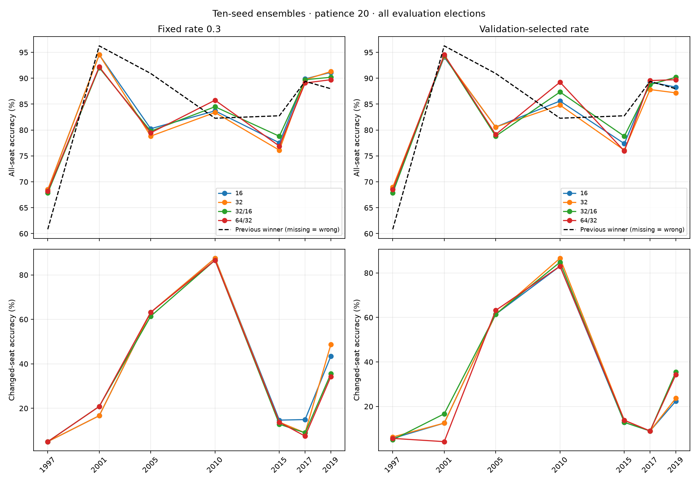
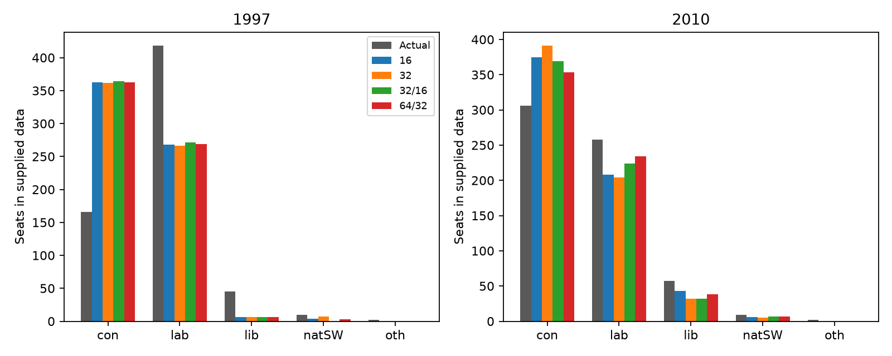

# All-election numerical results, 1997–2019

Generated by `summarize_all_elections.py`. All architecture comparisons below use ten-seed ensembles and patience 20. See [the main report](../REPORT_all_elections_progress.md) for interpretation.

## Temporal coverage

Rows with missing previous winners remain in all-seat metrics but are excluded from change/hold diagnostics. The all-row previous-winner baseline counts missing predictions as incorrect; the known-previous subset is the fair direct comparison.

| train_through | validation_year | evaluation_year | training_elections | training_rows | evaluation_rows | missing_training_classes | unseen_incumbents | constant_numeric_features | actual_changed_seats | missing_previous_winner | unseen_regions | unseen_region_rows |
| --- | --- | --- | --- | --- | --- | --- | --- | --- | --- | --- | --- | --- |
| 1987 | 1992 | 1997 | 1 | 633 | 641 | oth |  | Conservative,Labour,LD | 160 | 91 |  | 0 |
| 1992 | 1997 | 2001 | 2 | 1267 | 641 | oth | lab |  | 24 | 0 |  | 0 |
| 1997 | 2001 | 2005 | 3 | 1908 | 628 |  | lab |  | 57 | 0 |  | 0 |
| 2001 | 2005 | 2010 | 4 | 2549 | 632 |  |  |  | 112 | 0 |  | 0 |
| 2005 | 2010 | 2015 | 5 | 3177 | 632 |  |  |  | 109 | 0 |  | 0 |
| 2010 | 2015 | 2017 | 6 | 3809 | 632 |  |  |  | 67 | 0 |  | 0 |
| 2015 | 2017 | 2019 | 7 | 4441 | 632 |  |  |  | 76 | 0 |  | 0 |

## Architecture and learning-rate policy

Fixed 0.3 holds the rate constant across architectures. Validation-selected rates compare complete procedures, so their differences include both architecture and rate. Election means give each election equal weight. The overall/changed score averages overall and changed-seat accuracy, matching the existing pipeline selector's equal weighting up to a factor of two. It is reported descriptively; rates remain selected by validation log loss.

### fixed_0.3

| architecture | mean_accuracy | mean_changed_accuracy | mean_overall_changed_score | mean_log_loss | mean_seat_count_absolute_error |
| --- | --- | --- | --- | --- | --- |
| 16 | 83.65% | 35.05% | 0.593 | 0.532 | 175.429 |
| 32 | 83.19% | 34.82% | 0.590 | 0.538 | 181.714 |
| 32_16 | 83.27% | 33.02% | 0.581 | 0.541 | 181.429 |
| 64_32 | 83.04% | 33.00% | 0.580 | 0.544 | 183.429 |

Accuracy by election:

| evaluation_year | 16 | 32 | 32_16 | 64_32 |
| --- | --- | --- | --- | --- |
| 1997 | 68.49% | 68.49% | 67.86% | 68.17% |
| 2001 | 94.54% | 94.54% | 92.04% | 92.20% |
| 2005 | 80.25% | 78.82% | 79.78% | 79.46% |
| 2010 | 83.70% | 83.39% | 84.49% | 85.76% |
| 2015 | 77.53% | 76.11% | 78.80% | 76.90% |
| 2017 | 89.87% | 89.72% | 89.72% | 89.08% |
| 2019 | 91.14% | 91.30% | 90.19% | 89.72% |

Changed-seat accuracy by election:

| evaluation_year | 16 | 32 | 32_16 | 64_32 |
| --- | --- | --- | --- | --- |
| 1997 | 5.00% | 5.00% | 5.00% | 5.00% |
| 2001 | 16.67% | 16.67% | 20.83% | 20.83% |
| 2005 | 63.16% | 63.16% | 61.40% | 63.16% |
| 2010 | 87.50% | 87.50% | 86.61% | 86.61% |
| 2015 | 14.68% | 13.76% | 12.84% | 13.76% |
| 2017 | 14.93% | 8.96% | 8.96% | 7.46% |
| 2019 | 43.42% | 48.68% | 35.53% | 34.21% |

### validation_all_rates

| architecture | mean_accuracy | mean_changed_accuracy | mean_overall_changed_score | mean_log_loss | mean_seat_count_absolute_error |
| --- | --- | --- | --- | --- | --- |
| 16 | 83.40% | 29.53% | 0.565 | 0.519 | 176.000 |
| 32 | 82.81% | 30.45% | 0.566 | 0.535 | 186.857 |
| 32_16 | 83.74% | 32.17% | 0.580 | 0.528 | 172.571 |
| 64_32 | 83.80% | 30.42% | 0.571 | 0.533 | 169.429 |

Accuracy by election:

| evaluation_year | 16 | 32 | 32_16 | 64_32 |
| --- | --- | --- | --- | --- |
| 1997 | 68.64% | 68.95% | 67.86% | 68.49% |
| 2001 | 94.07% | 94.23% | 94.38% | 94.54% |
| 2005 | 80.57% | 80.57% | 78.82% | 79.14% |
| 2010 | 85.60% | 84.81% | 87.34% | 89.24% |
| 2015 | 77.37% | 76.11% | 78.80% | 75.95% |
| 2017 | 89.24% | 87.82% | 88.77% | 89.56% |
| 2019 | 88.29% | 87.18% | 90.19% | 89.72% |

Changed-seat accuracy by election:

| evaluation_year | 16 | 32 | 32_16 | 64_32 |
| --- | --- | --- | --- | --- |
| 1997 | 5.62% | 6.25% | 5.00% | 5.62% |
| 2001 | 12.50% | 12.50% | 16.67% | 4.17% |
| 2005 | 61.40% | 61.40% | 61.40% | 63.16% |
| 2010 | 83.04% | 86.61% | 84.82% | 83.04% |
| 2015 | 12.84% | 13.76% | 12.84% | 13.76% |
| 2017 | 8.96% | 8.96% | 8.96% | 8.96% |
| 2019 | 22.37% | 23.68% | 35.53% | 34.21% |

## 1997

| architecture | policy | learning_rate | accuracy | log_loss | previous_winner_accuracy | known_previous_accuracy | previous_winner_known_accuracy | unknown_previous_rows | changed_seats | correct_changes | false_changes_on_held_seats | seat_count_absolute_error |
| --- | --- | --- | --- | --- | --- | --- | --- | --- | --- | --- | --- | --- |
| 16 | validation_all_rates | 1.000 | 68.64% | 1.139 | 60.84% | 71.82% | 70.91% | 91 | 160 | 9 | 4 | 394 |
| 16 | fixed_0.3 | 0.300 | 68.49% | 1.338 | 60.84% | 71.64% | 70.91% | 91 | 160 | 8 | 4 | 398 |
| 32 | validation_all_rates | 1.000 | 68.95% | 1.174 | 60.84% | 72.18% | 70.91% | 91 | 160 | 10 | 3 | 392 |
| 32 | fixed_0.3 | 0.300 | 68.49% | 1.272 | 60.84% | 71.64% | 70.91% | 91 | 160 | 8 | 4 | 398 |
| 32_16 | validation_all_rates | 1.000 | 67.86% | 1.212 | 60.84% | 70.91% | 70.91% | 91 | 160 | 8 | 8 | 396 |
| 32_16 | fixed_0.3 | 0.300 | 67.86% | 1.336 | 60.84% | 70.91% | 70.91% | 91 | 160 | 8 | 8 | 398 |
| 64_32 | validation_all_rates | 1.000 | 68.49% | 1.172 | 60.84% | 71.64% | 70.91% | 91 | 160 | 9 | 5 | 394 |
| 64_32 | fixed_0.3 | 0.300 | 68.17% | 1.349 | 60.84% | 71.27% | 70.91% | 91 | 160 | 8 | 6 | 396 |

Validation-selected predicted seat totals:

| party | actual | 16 | 32 | 32_16 | 64_32 |
| --- | --- | --- | --- | --- | --- |
| con | 166 | 363 | 362 | 364 | 363 |
| lab | 418 | 268 | 266 | 271 | 269 |
| lib | 45 | 6 | 6 | 6 | 6 |
| natSW | 10 | 4 | 7 | 0 | 3 |
| oth | 2 | 0 | 0 | 0 | 0 |

Party-to-party changes (whole dataset, including boundary mappings):

| architecture | previous_party | actual_party | seats | correctly_predicted | predicted_previous_party |
| --- | --- | --- | --- | --- | --- |
| 16 | con | lab | 131 | 8 | 123 |
| 16 | con | lib | 24 | 0 | 23 |
| 16 | con | natSW | 2 | 0 | 2 |
| 16 | con | oth | 1 | 0 | 1 |
| 16 | lab | oth | 1 | 0 | 1 |
| 16 | lib | lab | 1 | 1 | 0 |
| 32 | con | lab | 131 | 7 | 124 |
| 32 | con | lib | 24 | 0 | 23 |
| 32 | con | natSW | 2 | 2 | 0 |
| 32 | con | oth | 1 | 0 | 1 |
| 32 | lab | oth | 1 | 0 | 1 |
| 32 | lib | lab | 1 | 1 | 0 |
| 32_16 | con | lab | 131 | 7 | 124 |
| 32_16 | con | lib | 24 | 0 | 23 |
| 32_16 | con | natSW | 2 | 0 | 2 |
| 32_16 | con | oth | 1 | 0 | 1 |
| 32_16 | lab | oth | 1 | 0 | 1 |
| 32_16 | lib | lab | 1 | 1 | 0 |
| 64_32 | con | lab | 131 | 8 | 123 |
| 64_32 | con | lib | 24 | 0 | 23 |
| 64_32 | con | natSW | 2 | 0 | 2 |
| 64_32 | con | oth | 1 | 0 | 1 |
| 64_32 | lab | oth | 1 | 0 | 1 |
| 64_32 | lib | lab | 1 | 1 | 0 |

## 2001

| architecture | policy | learning_rate | accuracy | log_loss | previous_winner_accuracy | known_previous_accuracy | previous_winner_known_accuracy | unknown_previous_rows | changed_seats | correct_changes | false_changes_on_held_seats | seat_count_absolute_error |
| --- | --- | --- | --- | --- | --- | --- | --- | --- | --- | --- | --- | --- |
| 16 | validation_all_rates | 1.000 | 94.07% | 0.207 | 96.26% | 94.07% | 96.26% | 0 | 24 | 3 | 17 | 56 |
| 16 | fixed_0.3 | 0.300 | 94.54% | 0.206 | 96.26% | 94.54% | 96.26% | 0 | 24 | 4 | 15 | 52 |
| 32 | validation_all_rates | 1.000 | 94.23% | 0.206 | 96.26% | 94.23% | 96.26% | 0 | 24 | 3 | 16 | 54 |
| 32 | fixed_0.3 | 0.300 | 94.54% | 0.226 | 96.26% | 94.54% | 96.26% | 0 | 24 | 4 | 15 | 52 |
| 32_16 | validation_all_rates | 1.000 | 94.38% | 0.229 | 96.26% | 94.38% | 96.26% | 0 | 24 | 4 | 16 | 54 |
| 32_16 | fixed_0.3 | 0.300 | 92.04% | 0.238 | 96.26% | 92.04% | 96.26% | 0 | 24 | 5 | 32 | 88 |
| 64_32 | validation_all_rates | 1.000 | 94.54% | 0.198 | 96.26% | 94.54% | 96.26% | 0 | 24 | 1 | 12 | 40 |
| 64_32 | fixed_0.3 | 0.300 | 92.20% | 0.247 | 96.26% | 92.20% | 96.26% | 0 | 24 | 5 | 31 | 86 |

Validation-selected predicted seat totals:

| party | actual | 16 | 32 | 32_16 | 64_32 |
| --- | --- | --- | --- | --- | --- |
| con | 166 | 187 | 186 | 186 | 178 |
| lab | 412 | 418 | 418 | 419 | 419 |
| lib | 52 | 26 | 27 | 28 | 34 |
| natSW | 9 | 10 | 10 | 8 | 10 |
| oth | 2 | 0 | 0 | 0 | 0 |

## 2005

| architecture | policy | learning_rate | accuracy | log_loss | previous_winner_accuracy | known_previous_accuracy | previous_winner_known_accuracy | unknown_previous_rows | changed_seats | correct_changes | false_changes_on_held_seats | seat_count_absolute_error |
| --- | --- | --- | --- | --- | --- | --- | --- | --- | --- | --- | --- | --- |
| 16 | validation_all_rates | 0.200 | 80.57% | 0.433 | 90.92% | 80.57% | 90.92% | 0 | 57 | 35 | 100 | 208 |
| 16 | fixed_0.3 | 0.300 | 80.25% | 0.444 | 90.92% | 80.25% | 90.92% | 0 | 57 | 36 | 103 | 216 |
| 32 | validation_all_rates | 0.500 | 80.57% | 0.421 | 90.92% | 80.57% | 90.92% | 0 | 57 | 35 | 100 | 208 |
| 32 | fixed_0.3 | 0.300 | 78.82% | 0.474 | 90.92% | 78.82% | 90.92% | 0 | 57 | 36 | 112 | 234 |
| 32_16 | validation_all_rates | 0.200 | 78.82% | 0.471 | 90.92% | 78.82% | 90.92% | 0 | 57 | 35 | 111 | 230 |
| 32_16 | fixed_0.3 | 0.300 | 79.78% | 0.452 | 90.92% | 79.78% | 90.92% | 0 | 57 | 35 | 105 | 218 |
| 64_32 | validation_all_rates | 0.200 | 79.14% | 0.460 | 90.92% | 79.14% | 90.92% | 0 | 57 | 36 | 110 | 230 |
| 64_32 | fixed_0.3 | 0.300 | 79.46% | 0.444 | 90.92% | 79.46% | 90.92% | 0 | 57 | 36 | 108 | 226 |

Validation-selected predicted seat totals:

| party | actual | 16 | 32 | 32_16 | 64_32 |
| --- | --- | --- | --- | --- | --- |
| con | 198 | 301 | 301 | 312 | 313 |
| lab | 355 | 279 | 281 | 270 | 271 |
| lib | 62 | 38 | 36 | 36 | 35 |
| natSW | 9 | 10 | 10 | 10 | 9 |
| oth | 4 | 0 | 0 | 0 | 0 |

## 2010

| architecture | policy | learning_rate | accuracy | log_loss | previous_winner_accuracy | known_previous_accuracy | previous_winner_known_accuracy | unknown_previous_rows | changed_seats | correct_changes | false_changes_on_held_seats | seat_count_absolute_error |
| --- | --- | --- | --- | --- | --- | --- | --- | --- | --- | --- | --- | --- |
| 16 | validation_all_rates | 1.000 | 85.60% | 0.353 | 82.28% | 85.60% | 82.28% | 0 | 112 | 93 | 72 | 138 |
| 16 | fixed_0.3 | 0.300 | 83.70% | 0.403 | 82.28% | 83.70% | 82.28% | 0 | 112 | 98 | 89 | 188 |
| 32 | validation_all_rates | 1.000 | 84.81% | 0.361 | 82.28% | 84.81% | 82.28% | 0 | 112 | 97 | 81 | 170 |
| 32 | fixed_0.3 | 0.300 | 83.39% | 0.403 | 82.28% | 83.39% | 82.28% | 0 | 112 | 98 | 91 | 194 |
| 32_16 | validation_all_rates | 1.000 | 87.34% | 0.353 | 82.28% | 87.34% | 82.28% | 0 | 112 | 95 | 63 | 126 |
| 32_16 | fixed_0.3 | 0.300 | 84.49% | 0.392 | 82.28% | 84.49% | 82.28% | 0 | 112 | 97 | 83 | 174 |
| 64_32 | validation_all_rates | 1.000 | 89.24% | 0.305 | 82.28% | 89.24% | 82.28% | 0 | 112 | 93 | 49 | 94 |
| 64_32 | fixed_0.3 | 0.300 | 85.76% | 0.360 | 82.28% | 85.76% | 82.28% | 0 | 112 | 97 | 75 | 156 |

Validation-selected predicted seat totals:

| party | actual | 16 | 32 | 32_16 | 64_32 |
| --- | --- | --- | --- | --- | --- |
| con | 306 | 375 | 391 | 369 | 353 |
| lab | 258 | 208 | 204 | 224 | 234 |
| lib | 57 | 43 | 32 | 32 | 38 |
| natSW | 9 | 6 | 5 | 7 | 7 |
| oth | 2 | 0 | 0 | 0 | 0 |

Party-to-party changes (whole dataset, including boundary mappings):

| architecture | previous_party | actual_party | seats | correctly_predicted | predicted_previous_party |
| --- | --- | --- | --- | --- | --- |
| 16 | con | lib | 3 | 0 | 3 |
| 16 | con | oth | 1 | 0 | 1 |
| 16 | lab | con | 87 | 86 | 1 |
| 16 | lab | lib | 5 | 0 | 4 |
| 16 | lab | natSW | 1 | 0 | 1 |
| 16 | lab | oth | 1 | 0 | 0 |
| 16 | lib | con | 12 | 7 | 5 |
| 16 | lib | lab | 1 | 0 | 1 |
| 16 | oth | lab | 1 | 0 | 0 |
| 32 | con | lib | 3 | 0 | 3 |
| 32 | con | oth | 1 | 0 | 1 |
| 32 | lab | con | 87 | 87 | 0 |
| 32 | lab | lib | 5 | 0 | 4 |
| 32 | lab | natSW | 1 | 0 | 1 |
| 32 | lab | oth | 1 | 0 | 0 |
| 32 | lib | con | 12 | 10 | 2 |
| 32 | lib | lab | 1 | 0 | 1 |
| 32 | oth | lab | 1 | 0 | 0 |
| 32_16 | con | lib | 3 | 0 | 3 |
| 32_16 | con | oth | 1 | 0 | 1 |
| 32_16 | lab | con | 87 | 85 | 2 |
| 32_16 | lab | lib | 5 | 0 | 5 |
| 32_16 | lab | natSW | 1 | 0 | 1 |
| 32_16 | lab | oth | 1 | 0 | 1 |
| 32_16 | lib | con | 12 | 10 | 2 |
| 32_16 | lib | lab | 1 | 0 | 1 |
| 32_16 | oth | lab | 1 | 0 | 0 |
| 64_32 | con | lib | 3 | 0 | 3 |
| 64_32 | con | oth | 1 | 0 | 1 |
| 64_32 | lab | con | 87 | 84 | 3 |
| 64_32 | lab | lib | 5 | 0 | 5 |
| 64_32 | lab | natSW | 1 | 0 | 1 |
| 64_32 | lab | oth | 1 | 0 | 1 |
| 64_32 | lib | con | 12 | 9 | 3 |
| 64_32 | lib | lab | 1 | 0 | 1 |
| 64_32 | oth | lab | 1 | 0 | 0 |

## 2015

| architecture | policy | learning_rate | accuracy | log_loss | previous_winner_accuracy | known_previous_accuracy | previous_winner_known_accuracy | unknown_previous_rows | changed_seats | correct_changes | false_changes_on_held_seats | seat_count_absolute_error |
| --- | --- | --- | --- | --- | --- | --- | --- | --- | --- | --- | --- | --- |
| 16 | validation_all_rates | 0.500 | 77.37% | 0.823 | 82.75% | 77.37% | 82.75% | 0 | 109 | 14 | 48 | 264 |
| 16 | fixed_0.3 | 0.300 | 77.53% | 0.828 | 82.75% | 77.53% | 82.75% | 0 | 109 | 16 | 49 | 266 |
| 32 | validation_all_rates | 0.300 | 76.11% | 0.890 | 82.75% | 76.11% | 82.75% | 0 | 109 | 15 | 57 | 284 |
| 32 | fixed_0.3 | 0.300 | 76.11% | 0.890 | 82.75% | 76.11% | 82.75% | 0 | 109 | 15 | 57 | 284 |
| 32_16 | validation_all_rates | 0.300 | 78.80% | 0.790 | 82.75% | 78.80% | 82.75% | 0 | 109 | 14 | 39 | 246 |
| 32_16 | fixed_0.3 | 0.300 | 78.80% | 0.790 | 82.75% | 78.80% | 82.75% | 0 | 109 | 14 | 39 | 246 |
| 64_32 | validation_all_rates | 1.000 | 75.95% | 0.955 | 82.75% | 75.95% | 82.75% | 0 | 109 | 15 | 58 | 286 |
| 64_32 | fixed_0.3 | 0.300 | 76.90% | 0.822 | 82.75% | 76.90% | 82.75% | 0 | 109 | 15 | 52 | 274 |

Validation-selected predicted seat totals:

| party | actual | 16 | 32 | 32_16 | 64_32 |
| --- | --- | --- | --- | --- | --- |
| con | 330 | 254 | 246 | 263 | 244 |
| lab | 231 | 321 | 332 | 312 | 334 |
| lib | 8 | 50 | 49 | 50 | 48 |
| natSW | 59 | 7 | 5 | 7 | 6 |
| oth | 4 | 0 | 0 | 0 | 0 |

## 2017

| architecture | policy | learning_rate | accuracy | log_loss | previous_winner_accuracy | known_previous_accuracy | previous_winner_known_accuracy | unknown_previous_rows | changed_seats | correct_changes | false_changes_on_held_seats | seat_count_absolute_error |
| --- | --- | --- | --- | --- | --- | --- | --- | --- | --- | --- | --- | --- |
| 16 | validation_all_rates | 1.000 | 89.24% | 0.378 | 89.40% | 89.24% | 89.40% | 0 | 67 | 6 | 7 | 86 |
| 16 | fixed_0.3 | 0.300 | 89.87% | 0.284 | 89.40% | 89.87% | 89.40% | 0 | 67 | 10 | 7 | 62 |
| 32 | validation_all_rates | 1.000 | 87.82% | 0.402 | 89.40% | 87.82% | 89.40% | 0 | 67 | 6 | 16 | 104 |
| 32 | fixed_0.3 | 0.300 | 89.72% | 0.283 | 89.40% | 89.72% | 89.40% | 0 | 67 | 6 | 4 | 74 |
| 32_16 | validation_all_rates | 1.000 | 88.77% | 0.395 | 89.40% | 88.77% | 89.40% | 0 | 67 | 6 | 10 | 90 |
| 32_16 | fixed_0.3 | 0.300 | 89.72% | 0.334 | 89.40% | 89.72% | 89.40% | 0 | 67 | 6 | 4 | 80 |
| 64_32 | validation_all_rates | 1.000 | 89.56% | 0.404 | 89.40% | 89.56% | 89.40% | 0 | 67 | 6 | 5 | 80 |
| 64_32 | fixed_0.3 | 0.300 | 89.08% | 0.348 | 89.40% | 89.08% | 89.40% | 0 | 67 | 5 | 7 | 84 |

Validation-selected predicted seat totals:

| party | actual | 16 | 32 | 32_16 | 64_32 |
| --- | --- | --- | --- | --- | --- |
| con | 319 | 339 | 348 | 338 | 335 |
| lab | 261 | 231 | 222 | 229 | 234 |
| lib | 13 | 2 | 2 | 2 | 2 |
| natSW | 37 | 60 | 60 | 63 | 61 |
| oth | 2 | 0 | 0 | 0 | 0 |

## 2019

| architecture | policy | learning_rate | accuracy | log_loss | previous_winner_accuracy | known_previous_accuracy | previous_winner_known_accuracy | unknown_previous_rows | changed_seats | correct_changes | false_changes_on_held_seats | seat_count_absolute_error |
| --- | --- | --- | --- | --- | --- | --- | --- | --- | --- | --- | --- | --- |
| 16 | validation_all_rates | 0.050 | 88.29% | 0.296 | 87.97% | 88.29% | 87.97% | 0 | 76 | 17 | 15 | 86 |
| 16 | fixed_0.3 | 0.300 | 91.14% | 0.223 | 87.97% | 91.14% | 87.97% | 0 | 76 | 33 | 13 | 46 |
| 32 | validation_all_rates | 0.050 | 87.18% | 0.293 | 87.97% | 87.18% | 87.97% | 0 | 76 | 18 | 23 | 96 |
| 32 | fixed_0.3 | 0.300 | 91.30% | 0.219 | 87.97% | 91.30% | 87.97% | 0 | 76 | 37 | 16 | 36 |
| 32_16 | validation_all_rates | 0.300 | 90.19% | 0.244 | 87.97% | 90.19% | 87.97% | 0 | 76 | 27 | 13 | 66 |
| 32_16 | fixed_0.3 | 0.300 | 90.19% | 0.244 | 87.97% | 90.19% | 87.97% | 0 | 76 | 27 | 13 | 66 |
| 64_32 | validation_all_rates | 0.300 | 89.72% | 0.236 | 87.97% | 89.72% | 87.97% | 0 | 76 | 26 | 15 | 62 |
| 64_32 | fixed_0.3 | 0.300 | 89.72% | 0.236 | 87.97% | 89.72% | 87.97% | 0 | 76 | 26 | 15 | 62 |

Validation-selected predicted seat totals:

| party | actual | 16 | 32 | 32_16 | 64_32 |
| --- | --- | --- | --- | --- | --- |
| con | 365 | 350 | 353 | 351 | 353 |
| lab | 202 | 245 | 250 | 235 | 233 |
| lib | 11 | 5 | 5 | 1 | 2 |
| natSW | 52 | 32 | 24 | 45 | 44 |
| oth | 2 | 0 | 0 | 0 | 0 |

## Patience sensitivity

| architecture | patience | mean_accuracy | mean_changed_accuracy | mean_log_loss |
| --- | --- | --- | --- | --- |
| 16 | 10 | 83.08% | 30.42% | 0.523 |
| 16 | 20 | 83.40% | 29.53% | 0.519 |
| 16 | 50 | 83.44% | 29.66% | 0.521 |
| 32 | 10 | 83.06% | 30.45% | 0.529 |
| 32 | 20 | 82.81% | 30.45% | 0.535 |
| 32 | 50 | 82.49% | 31.34% | 0.543 |
| 32_16 | 10 | 83.81% | 32.42% | 0.526 |
| 32_16 | 20 | 83.74% | 32.17% | 0.528 |
| 32_16 | 50 | 83.74% | 32.17% | 0.528 |
| 64_32 | 10 | 83.89% | 30.17% | 0.534 |
| 64_32 | 20 | 83.80% | 30.42% | 0.533 |
| 64_32 | 50 | 83.74% | 30.42% | 0.535 |

## Selection stability

| evaluation_year | architecture | learning_rate_3seed | learning_rate_10seed |
| --- | --- | --- | --- |
| 1997 | 16 | 0.500 | 1.000 |
| 1997 | 32 | 0.500 | 1.000 |
| 1997 | 32_16 | 0.200 | 1.000 |
| 1997 | 64_32 | 1.000 | 1.000 |
| 2001 | 16 | 1.000 | 1.000 |
| 2001 | 32 | 1.000 | 1.000 |
| 2001 | 32_16 | 1.000 | 1.000 |
| 2001 | 64_32 | 1.000 | 1.000 |
| 2005 | 16 | 0.200 | 0.200 |
| 2005 | 32 | 0.500 | 0.500 |
| 2005 | 32_16 | 0.100 | 0.200 |
| 2005 | 64_32 | 0.200 | 0.200 |
| 2010 | 16 | 1.000 | 1.000 |
| 2010 | 32 | 1.000 | 1.000 |
| 2010 | 32_16 | 1.000 | 1.000 |
| 2010 | 64_32 | 0.200 | 1.000 |
| 2015 | 16 | 0.300 | 0.500 |
| 2015 | 32 | 0.100 | 0.300 |
| 2015 | 32_16 | 0.500 | 0.300 |
| 2015 | 64_32 | 0.300 | 1.000 |
| 2017 | 16 | 1.000 | 1.000 |
| 2017 | 32 | 1.000 | 1.000 |
| 2017 | 32_16 | 1.000 | 1.000 |
| 2017 | 64_32 | 1.000 | 1.000 |
| 2019 | 16 | 0.050 | 0.050 |
| 2019 | 32 | 0.010 | 0.050 |
| 2019 | 32_16 | 0.300 | 0.300 |
| 2019 | 64_32 | 0.300 | 0.300 |

## Paired predictions versus 32/16

| evaluation_year | policy | architecture | disagreement_seats | challenger_only_correct | baseline_only_correct | net_correct_seats |
| --- | --- | --- | --- | --- | --- | --- |
| 1997 | validation_all_rates | 16 | 5 | 5 | 0 | 5 |
| 1997 | fixed_0.3 | 16 | 7 | 5 | 1 | 4 |
| 1997 | validation_all_rates | 32 | 7 | 7 | 0 | 7 |
| 1997 | fixed_0.3 | 32 | 7 | 5 | 1 | 4 |
| 1997 | validation_all_rates | 64_32 | 4 | 4 | 0 | 4 |
| 1997 | fixed_0.3 | 64_32 | 2 | 2 | 0 | 2 |
| 2001 | validation_all_rates | 16 | 4 | 1 | 3 | -2 |
| 2001 | fixed_0.3 | 16 | 18 | 17 | 1 | 16 |
| 2001 | validation_all_rates | 32 | 5 | 2 | 3 | -1 |
| 2001 | fixed_0.3 | 32 | 18 | 17 | 1 | 16 |
| 2001 | validation_all_rates | 64_32 | 9 | 5 | 4 | 1 |
| 2001 | fixed_0.3 | 64_32 | 5 | 3 | 2 | 1 |
| 2005 | validation_all_rates | 16 | 11 | 11 | 0 | 11 |
| 2005 | fixed_0.3 | 16 | 9 | 6 | 3 | 3 |
| 2005 | validation_all_rates | 32 | 11 | 11 | 0 | 11 |
| 2005 | fixed_0.3 | 32 | 8 | 1 | 7 | -6 |
| 2005 | validation_all_rates | 64_32 | 7 | 4 | 2 | 2 |
| 2005 | fixed_0.3 | 64_32 | 4 | 1 | 3 | -2 |
| 2010 | validation_all_rates | 16 | 27 | 7 | 18 | -11 |
| 2010 | fixed_0.3 | 16 | 15 | 5 | 10 | -5 |
| 2010 | validation_all_rates | 32 | 22 | 2 | 18 | -16 |
| 2010 | fixed_0.3 | 32 | 13 | 3 | 10 | -7 |
| 2010 | validation_all_rates | 64_32 | 16 | 14 | 2 | 12 |
| 2010 | fixed_0.3 | 64_32 | 9 | 8 | 0 | 8 |
| 2015 | validation_all_rates | 16 | 9 | 0 | 9 | -9 |
| 2015 | fixed_0.3 | 16 | 14 | 3 | 11 | -8 |
| 2015 | validation_all_rates | 32 | 20 | 1 | 18 | -17 |
| 2015 | fixed_0.3 | 32 | 20 | 1 | 18 | -17 |
| 2015 | validation_all_rates | 64_32 | 22 | 1 | 19 | -18 |
| 2015 | fixed_0.3 | 64_32 | 15 | 1 | 13 | -12 |
| 2017 | validation_all_rates | 16 | 3 | 3 | 0 | 3 |
| 2017 | fixed_0.3 | 16 | 10 | 5 | 4 | 1 |
| 2017 | validation_all_rates | 32 | 12 | 3 | 9 | -6 |
| 2017 | fixed_0.3 | 32 | 3 | 1 | 1 | 0 |
| 2017 | validation_all_rates | 64_32 | 5 | 5 | 0 | 5 |
| 2017 | fixed_0.3 | 64_32 | 4 | 0 | 4 | -4 |
| 2019 | validation_all_rates | 16 | 18 | 3 | 15 | -12 |
| 2019 | fixed_0.3 | 16 | 14 | 10 | 4 | 6 |
| 2019 | validation_all_rates | 32 | 25 | 3 | 22 | -19 |
| 2019 | fixed_0.3 | 32 | 17 | 12 | 5 | 7 |
| 2019 | validation_all_rates | 64_32 | 5 | 1 | 4 | -3 |
| 2019 | fixed_0.3 | 64_32 | 5 | 1 | 4 | -3 |

## Seed variability

Individual-seed accuracy spread measures optimisation sensitivity, not uncertainty over future elections. Ensemble accuracy need not equal mean individual accuracy.

| evaluation_year | architecture | policy | seed_accuracy_mean | seed_accuracy_sd | seed_accuracy_min | seed_accuracy_max | seed_changed_accuracy_sd |
| --- | --- | --- | --- | --- | --- | --- | --- |
| 1997 | 16 | fixed_0.3 | 68.19% | 0.58% | 67.55% | 69.27% | 1.38% |
| 1997 | 16 | validation_all_rates | 69.30% | 1.26% | 67.71% | 71.45% | 4.99% |
| 1997 | 32 | fixed_0.3 | 68.22% | 0.41% | 67.71% | 68.80% | 1.07% |
| 1997 | 32 | validation_all_rates | 69.36% | 1.75% | 67.39% | 73.32% | 6.58% |
| 1997 | 32_16 | fixed_0.3 | 68.28% | 1.51% | 66.77% | 72.07% | 6.36% |
| 1997 | 32_16 | validation_all_rates | 68.78% | 2.21% | 66.93% | 74.88% | 9.98% |
| 1997 | 64_32 | fixed_0.3 | 67.94% | 0.63% | 66.77% | 68.80% | 2.38% |
| 1997 | 64_32 | validation_all_rates | 69.56% | 2.76% | 65.68% | 74.88% | 9.48% |
| 2001 | 16 | fixed_0.3 | 92.79% | 2.52% | 87.36% | 95.79% | 8.88% |
| 2001 | 16 | validation_all_rates | 92.25% | 2.94% | 87.21% | 95.79% | 9.01% |
| 2001 | 32 | fixed_0.3 | 92.37% | 2.92% | 85.34% | 95.32% | 9.38% |
| 2001 | 32 | validation_all_rates | 92.90% | 2.45% | 88.46% | 96.41% | 8.56% |
| 2001 | 32_16 | fixed_0.3 | 91.45% | 2.84% | 86.27% | 95.16% | 9.04% |
| 2001 | 32_16 | validation_all_rates | 92.12% | 2.31% | 87.05% | 95.16% | 5.57% |
| 2001 | 64_32 | fixed_0.3 | 90.09% | 4.80% | 81.75% | 96.57% | 11.63% |
| 2001 | 64_32 | validation_all_rates | 93.17% | 2.26% | 88.77% | 95.32% | 6.27% |
| 2005 | 16 | fixed_0.3 | 80.65% | 1.93% | 78.66% | 84.71% | 4.05% |
| 2005 | 16 | validation_all_rates | 80.94% | 3.24% | 76.43% | 86.94% | 4.69% |
| 2005 | 32 | fixed_0.3 | 79.11% | 2.55% | 75.48% | 82.96% | 1.29% |
| 2005 | 32 | validation_all_rates | 80.83% | 4.13% | 76.43% | 90.92% | 4.09% |
| 2005 | 32_16 | fixed_0.3 | 80.19% | 3.87% | 72.29% | 86.78% | 2.49% |
| 2005 | 32_16 | validation_all_rates | 79.55% | 3.90% | 73.89% | 88.06% | 4.77% |
| 2005 | 64_32 | fixed_0.3 | 79.94% | 4.59% | 71.82% | 88.06% | 8.68% |
| 2005 | 64_32 | validation_all_rates | 79.57% | 4.19% | 74.04% | 89.17% | 9.92% |
| 2010 | 16 | fixed_0.3 | 82.63% | 3.66% | 75.63% | 87.34% | 1.19% |
| 2010 | 16 | validation_all_rates | 83.70% | 3.65% | 77.22% | 87.18% | 14.22% |
| 2010 | 32 | fixed_0.3 | 82.39% | 5.19% | 73.58% | 88.45% | 4.84% |
| 2010 | 32 | validation_all_rates | 83.26% | 5.57% | 71.20% | 89.24% | 9.69% |
| 2010 | 32_16 | fixed_0.3 | 83.67% | 4.79% | 74.21% | 89.56% | 4.02% |
| 2010 | 32_16 | validation_all_rates | 85.32% | 3.07% | 79.75% | 89.24% | 4.13% |
| 2010 | 64_32 | fixed_0.3 | 84.95% | 3.72% | 79.11% | 89.24% | 4.69% |
| 2010 | 64_32 | validation_all_rates | 87.47% | 2.56% | 82.44% | 90.51% | 7.76% |
| 2015 | 16 | fixed_0.3 | 77.50% | 3.37% | 71.99% | 82.44% | 3.47% |
| 2015 | 16 | validation_all_rates | 77.74% | 2.70% | 74.68% | 82.12% | 5.39% |
| 2015 | 32 | fixed_0.3 | 75.74% | 2.82% | 70.57% | 78.64% | 2.28% |
| 2015 | 32 | validation_all_rates | 75.74% | 2.82% | 70.57% | 78.64% | 2.28% |
| 2015 | 32_16 | fixed_0.3 | 78.50% | 3.67% | 71.36% | 84.18% | 5.56% |
| 2015 | 32_16 | validation_all_rates | 78.50% | 3.67% | 71.36% | 84.18% | 5.56% |
| 2015 | 64_32 | fixed_0.3 | 77.14% | 1.40% | 75.63% | 80.38% | 3.11% |
| 2015 | 64_32 | validation_all_rates | 75.93% | 3.01% | 70.09% | 81.33% | 4.93% |
| 2017 | 16 | fixed_0.3 | 88.43% | 1.81% | 84.81% | 90.19% | 9.85% |
| 2017 | 16 | validation_all_rates | 88.15% | 1.91% | 84.65% | 89.87% | 2.67% |
| 2017 | 32 | fixed_0.3 | 89.26% | 1.15% | 87.18% | 90.66% | 8.96% |
| 2017 | 32 | validation_all_rates | 87.83% | 2.02% | 84.02% | 89.72% | 4.41% |
| 2017 | 32_16 | fixed_0.3 | 88.07% | 1.79% | 84.18% | 89.72% | 6.33% |
| 2017 | 32_16 | validation_all_rates | 87.15% | 2.87% | 79.75% | 89.56% | 3.07% |
| 2017 | 64_32 | fixed_0.3 | 87.85% | 2.63% | 81.65% | 89.72% | 4.51% |
| 2017 | 64_32 | validation_all_rates | 88.20% | 1.79% | 84.81% | 90.35% | 6.05% |
| 2019 | 16 | fixed_0.3 | 90.89% | 0.80% | 89.72% | 92.25% | 11.52% |
| 2019 | 16 | validation_all_rates | 87.09% | 2.15% | 83.86% | 91.30% | 12.29% |
| 2019 | 32 | fixed_0.3 | 90.82% | 0.59% | 89.87% | 91.77% | 15.26% |
| 2019 | 32 | validation_all_rates | 86.27% | 1.69% | 83.54% | 88.45% | 10.47% |
| 2019 | 32_16 | fixed_0.3 | 88.75% | 3.15% | 83.70% | 91.61% | 16.11% |
| 2019 | 32_16 | validation_all_rates | 88.75% | 3.15% | 83.70% | 91.61% | 16.11% |
| 2019 | 64_32 | fixed_0.3 | 89.34% | 2.07% | 85.13% | 91.77% | 15.77% |
| 2019 | 64_32 | validation_all_rates | 89.34% | 2.07% | 85.13% | 91.77% | 15.77% |

## Network size and stopping

| train_through | architecture | parameters | median_best_epoch | max_best_epoch | capped_runs |
| --- | --- | --- | --- | --- | --- |
| 1987 | 16 | 533 | 16.000 | 218 | 0 |
| 1987 | 32 | 1061 | 12.000 | 245 | 0 |
| 1987 | 32_16 | 1509 | 13.000 | 196 | 0 |
| 1987 | 64_32 | 4037 | 13.000 | 147 | 0 |
| 1992 | 16 | 549 | 6.000 | 190 | 0 |
| 1992 | 32 | 1093 | 9.000 | 113 | 0 |
| 1992 | 32_16 | 1541 | 7.000 | 92 | 0 |
| 1992 | 64_32 | 4101 | 5.000 | 76 | 0 |
| 1997 | 16 | 549 | 29.500 | 638 | 0 |
| 1997 | 32 | 1093 | 26.000 | 443 | 0 |
| 1997 | 32_16 | 1541 | 19.500 | 338 | 0 |
| 1997 | 64_32 | 4101 | 24.000 | 306 | 0 |
| 2001 | 16 | 581 | 6.500 | 58 | 0 |
| 2001 | 32 | 1157 | 6.000 | 65 | 0 |
| 2001 | 32_16 | 1605 | 7.000 | 84 | 0 |
| 2001 | 64_32 | 4229 | 7.000 | 84 | 0 |
| 2005 | 16 | 581 | 18.000 | 251 | 0 |
| 2005 | 32 | 1157 | 8.000 | 203 | 0 |
| 2005 | 32_16 | 1605 | 16.000 | 157 | 0 |
| 2005 | 64_32 | 4229 | 10.500 | 152 | 0 |
| 2010 | 16 | 581 | 3.000 | 32 | 0 |
| 2010 | 32 | 1157 | 3.000 | 46 | 0 |
| 2010 | 32_16 | 1605 | 13.000 | 57 | 0 |
| 2010 | 64_32 | 4229 | 11.000 | 89 | 0 |
| 2015 | 16 | 581 | 3.000 | 33 | 0 |
| 2015 | 32 | 1157 | 3.000 | 21 | 0 |
| 2015 | 32_16 | 1605 | 4.000 | 33 | 0 |
| 2015 | 64_32 | 4229 | 4.000 | 27 | 0 |

## Polling support in training

An out-of-range input identifies extrapolation, not proof that it caused an error. Poll columns are constant within each election.

| evaluation_year | feature | training_min | training_max | evaluation_value | outside_training_range |
| --- | --- | --- | --- | --- | --- |
| 1997 | Conservative | 42.69% | 42.69% | 30.91% | True |
| 1997 | Labour | 34.12% | 34.12% | 49.32% | True |
| 1997 | LD | 21.47% | 21.47% | 13.42% | True |
| 2001 | Conservative | 37.73% | 42.69% | 31.43% | True |
| 2001 | Labour | 34.12% | 39.03% | 44.86% | True |
| 2001 | LD | 19.47% | 21.47% | 17.67% | True |
| 2005 | Conservative | 30.91% | 42.69% | 32.62% | False |
| 2005 | Labour | 34.12% | 49.32% | 37.50% | False |
| 2005 | LD | 13.42% | 21.47% | 22.75% | True |
| 2010 | Conservative | 30.91% | 42.69% | 35.77% | False |
| 2010 | Labour | 34.12% | 49.32% | 28.08% | True |
| 2010 | LD | 13.42% | 21.47% | 27.00% | True |
| 2015 | Conservative | 30.91% | 42.69% | 33.58% | False |
| 2015 | Labour | 34.12% | 49.32% | 33.37% | True |
| 2015 | LD | 13.42% | 22.75% | 9.21% | True |
| 2017 | Conservative | 30.91% | 42.69% | 42.87% | True |
| 2017 | Labour | 28.08% | 49.32% | 36.80% | False |
| 2017 | LD | 13.42% | 27.00% | 7.73% | True |
| 2019 | Conservative | 30.91% | 42.69% | 43.10% | True |
| 2019 | Labour | 28.08% | 49.32% | 33.24% | False |
| 2019 | LD | 9.21% | 27.00% | 12.01% | False |

## Learning-rate sensitivity

| architecture | learning_rate | mean_validation_loss | mean_accuracy | mean_log_loss |
| --- | --- | --- | --- | --- |
| 16 | 0.010 | 0.379 | 81.42% | 0.583 |
| 16 | 0.030 | 0.371 | 81.74% | 0.575 |
| 16 | 0.050 | 0.372 | 81.89% | 0.571 |
| 16 | 0.100 | 0.364 | 82.68% | 0.549 |
| 16 | 0.200 | 0.364 | 83.13% | 0.538 |
| 16 | 0.300 | 0.365 | 83.65% | 0.532 |
| 16 | 0.500 | 0.354 | 83.63% | 0.512 |
| 16 | 1.000 | 0.334 | 83.65% | 0.518 |
| 32 | 0.010 | 0.391 | 81.42% | 0.593 |
| 32 | 0.030 | 0.385 | 81.82% | 0.574 |
| 32 | 0.050 | 0.382 | 82.04% | 0.570 |
| 32 | 0.100 | 0.377 | 82.38% | 0.558 |
| 32 | 0.200 | 0.372 | 82.79% | 0.533 |
| 32 | 0.300 | 0.372 | 83.19% | 0.538 |
| 32 | 0.500 | 0.371 | 83.92% | 0.516 |
| 32 | 1.000 | 0.348 | 83.51% | 0.519 |
| 32_16 | 0.010 | 0.408 | 80.63% | 0.594 |
| 32_16 | 0.030 | 0.385 | 81.18% | 0.550 |
| 32_16 | 0.050 | 0.382 | 81.45% | 0.546 |
| 32_16 | 0.100 | 0.370 | 81.76% | 0.549 |
| 32_16 | 0.200 | 0.357 | 82.62% | 0.567 |
| 32_16 | 0.300 | 0.348 | 83.27% | 0.541 |
| 32_16 | 0.500 | 0.333 | 83.94% | 0.543 |
| 32_16 | 1.000 | 0.309 | 84.24% | 0.541 |
| 64_32 | 0.010 | 0.404 | 81.00% | 0.585 |
| 64_32 | 0.030 | 0.392 | 80.81% | 0.572 |
| 64_32 | 0.050 | 0.386 | 81.47% | 0.580 |
| 64_32 | 0.100 | 0.371 | 81.96% | 0.577 |
| 64_32 | 0.200 | 0.358 | 82.95% | 0.553 |
| 64_32 | 0.300 | 0.342 | 83.04% | 0.544 |
| 64_32 | 0.500 | 0.338 | 83.15% | 0.519 |
| 64_32 | 1.000 | 0.311 | 84.03% | 0.528 |

## Sensitivity to individual elections

Each row omits one evaluation election from the descriptive average; no models are refitted or selected again. These overlapping summaries are sensitivity checks, not independent tests. Persistence comparisons use only rows with a known previous winner.

| omitted_election | policy | architecture | elections | mean_accuracy | mean_log_loss | mean_overall_changed_score | mean_known_history_gain_pp | elections_beating_persistence | accuracy_rank | log_loss_rank | overall_changed_rank |
| --- | --- | --- | --- | --- | --- | --- | --- | --- | --- | --- | --- |
| none | validation_all_rates | 16 | 7 | 83.40% | 0.519 | 0.565 | -1.932 | 3 | 3.000 | 1.000 | 4.000 |
| none | fixed_0.3 | 16 | 7 | 83.65% | 0.532 | 0.593 | -1.688 | 4 | 1.000 | 1.000 | 1.000 |
| none | validation_all_rates | 32 | 7 | 82.81% | 0.535 | 0.566 | -2.513 | 2 | 4.000 | 4.000 | 3.000 |
| none | fixed_0.3 | 32 | 7 | 83.19% | 0.538 | 0.590 | -2.141 | 4 | 3.000 | 2.000 | 2.000 |
| none | validation_all_rates | 32_16 | 7 | 83.74% | 0.528 | 0.580 | -1.612 | 2 | 2.000 | 2.000 | 1.000 |
| none | fixed_0.3 | 32_16 | 7 | 83.27% | 0.541 | 0.581 | -2.081 | 3 | 2.000 | 3.000 | 3.000 |
| none | validation_all_rates | 64_32 | 7 | 83.80% | 0.533 | 0.571 | -1.531 | 4 | 1.000 | 3.000 | 2.000 |
| none | fixed_0.3 | 64_32 | 7 | 83.04% | 0.544 | 0.580 | -2.301 | 3 | 4.000 | 4.000 | 4.000 |
| 1997 | validation_all_rates | 16 | 6 | 85.86% | 0.415 | 0.597 | -2.406 | 2 | 3.000 | 2.000 | 4.000 |
| 1997 | fixed_0.3 | 16 | 6 | 86.17% | 0.398 | 0.631 | -2.091 | 3 | 1.000 | 1.000 | 1.000 |
| 1997 | validation_all_rates | 32 | 6 | 85.12% | 0.429 | 0.598 | -3.144 | 1 | 4.000 | 4.000 | 3.000 |
| 1997 | fixed_0.3 | 32 | 6 | 85.64% | 0.416 | 0.627 | -2.619 | 3 | 3.000 | 4.000 | 2.000 |
| 1997 | validation_all_rates | 32_16 | 6 | 86.38% | 0.413 | 0.615 | -1.881 | 2 | 1.000 | 1.000 | 1.000 |
| 1997 | fixed_0.3 | 32_16 | 6 | 85.84% | 0.408 | 0.618 | -2.428 | 3 | 2.000 | 2.000 | 3.000 |
| 1997 | validation_all_rates | 64_32 | 6 | 86.36% | 0.426 | 0.605 | -1.907 | 3 | 2.000 | 3.000 | 2.000 |
| 1997 | fixed_0.3 | 64_32 | 6 | 85.52% | 0.410 | 0.616 | -2.745 | 2 | 4.000 | 3.000 | 4.000 |
| 2001 | validation_all_rates | 16 | 6 | 81.62% | 0.570 | 0.570 | -1.890 | 3 | 3.000 | 1.000 | 4.000 |
| 2001 | fixed_0.3 | 16 | 6 | 81.83% | 0.587 | 0.600 | -1.683 | 4 | 1.000 | 1.000 | 1.000 |
| 2001 | validation_all_rates | 32 | 6 | 80.91% | 0.590 | 0.572 | -2.594 | 2 | 4.000 | 4.000 | 3.000 |
| 2001 | fixed_0.3 | 32 | 6 | 81.30% | 0.590 | 0.596 | -2.212 | 4 | 4.000 | 2.000 | 2.000 |
| 2001 | validation_all_rates | 32_16 | 6 | 81.96% | 0.577 | 0.584 | -1.569 | 2 | 2.000 | 2.000 | 2.000 |
| 2001 | fixed_0.3 | 32_16 | 6 | 81.81% | 0.591 | 0.584 | -1.726 | 3 | 2.000 | 3.000 | 3.000 |
| 2001 | validation_all_rates | 64_32 | 6 | 82.01% | 0.589 | 0.584 | -1.500 | 4 | 1.000 | 3.000 | 1.000 |
| 2001 | fixed_0.3 | 64_32 | 6 | 81.51% | 0.593 | 0.583 | -2.008 | 3 | 3.000 | 4.000 | 4.000 |
| 2005 | validation_all_rates | 16 | 6 | 83.87% | 0.533 | 0.540 | -0.529 | 3 | 3.000 | 1.000 | 4.000 |
| 2005 | fixed_0.3 | 16 | 6 | 84.21% | 0.547 | 0.573 | -0.191 | 4 | 1.000 | 1.000 | 1.000 |
| 2005 | validation_all_rates | 32 | 6 | 83.18% | 0.554 | 0.542 | -1.207 | 2 | 4.000 | 4.000 | 3.000 |
| 2005 | fixed_0.3 | 32 | 6 | 83.92% | 0.549 | 0.570 | -0.481 | 4 | 2.000 | 2.000 | 2.000 |
| 2005 | validation_all_rates | 32_16 | 6 | 84.56% | 0.537 | 0.559 | 0.136 | 2 | 2.000 | 2.000 | 1.000 |
| 2005 | fixed_0.3 | 32_16 | 6 | 83.85% | 0.556 | 0.561 | -0.570 | 3 | 3.000 | 3.000 | 3.000 |
| 2005 | validation_all_rates | 64_32 | 6 | 84.58% | 0.545 | 0.548 | 0.178 | 4 | 1.000 | 3.000 | 2.000 |
| 2005 | fixed_0.3 | 64_32 | 6 | 83.64% | 0.560 | 0.558 | -0.774 | 3 | 4.000 | 4.000 | 4.000 |
| 2010 | validation_all_rates | 16 | 6 | 83.03% | 0.546 | 0.518 | -2.808 | 2 | 2.000 | 1.000 | 3.000 |
| 2010 | fixed_0.3 | 16 | 6 | 83.64% | 0.554 | 0.550 | -2.207 | 3 | 1.000 | 1.000 | 1.000 |
| 2010 | validation_all_rates | 32 | 6 | 82.48% | 0.564 | 0.518 | -3.354 | 1 | 4.000 | 3.000 | 4.000 |
| 2010 | fixed_0.3 | 32 | 6 | 83.16% | 0.561 | 0.546 | -2.683 | 3 | 2.000 | 2.000 | 2.000 |
| 2010 | validation_all_rates | 32_16 | 6 | 83.14% | 0.557 | 0.533 | -2.725 | 1 | 1.000 | 2.000 | 1.000 |
| 2010 | fixed_0.3 | 32_16 | 6 | 83.06% | 0.566 | 0.536 | -2.797 | 2 | 3.000 | 3.000 | 3.000 |
| 2010 | validation_all_rates | 64_32 | 6 | 82.90% | 0.571 | 0.523 | -2.946 | 3 | 3.000 | 4.000 | 2.000 |
| 2010 | fixed_0.3 | 64_32 | 6 | 82.59% | 0.574 | 0.533 | -3.265 | 2 | 4.000 | 4.000 | 4.000 |
| 2015 | validation_all_rates | 16 | 6 | 84.40% | 0.468 | 0.584 | -1.357 | 3 | 3.000 | 2.000 | 4.000 |
| 2015 | fixed_0.3 | 16 | 6 | 84.67% | 0.483 | 0.616 | -1.099 | 4 | 1.000 | 2.000 | 1.000 |
| 2015 | validation_all_rates | 32 | 6 | 83.93% | 0.476 | 0.586 | -1.825 | 2 | 4.000 | 3.000 | 3.000 |
| 2015 | fixed_0.3 | 32 | 6 | 84.37% | 0.479 | 0.614 | -1.391 | 4 | 2.000 | 1.000 | 2.000 |
| 2015 | validation_all_rates | 32_16 | 6 | 84.56% | 0.484 | 0.600 | -1.221 | 2 | 2.000 | 4.000 | 1.000 |
| 2015 | fixed_0.3 | 32_16 | 6 | 84.01% | 0.499 | 0.602 | -1.769 | 3 | 4.000 | 4.000 | 3.000 |
| 2015 | validation_all_rates | 64_32 | 6 | 85.11% | 0.463 | 0.592 | -0.652 | 4 | 1.000 | 1.000 | 2.000 |
| 2015 | fixed_0.3 | 64_32 | 6 | 84.06% | 0.497 | 0.601 | -1.709 | 3 | 3.000 | 3.000 | 4.000 |
| 2017 | validation_all_rates | 16 | 6 | 82.43% | 0.542 | 0.577 | -2.228 | 3 | 3.000 | 1.000 | 4.000 |
| 2017 | fixed_0.3 | 16 | 6 | 82.61% | 0.574 | 0.605 | -2.048 | 3 | 1.000 | 1.000 | 2.000 |
| 2017 | validation_all_rates | 32 | 6 | 81.98% | 0.558 | 0.580 | -2.668 | 2 | 4.000 | 4.000 | 3.000 |
| 2017 | fixed_0.3 | 32 | 6 | 82.11% | 0.581 | 0.606 | -2.551 | 3 | 3.000 | 4.000 | 1.000 |
| 2017 | validation_all_rates | 32_16 | 6 | 82.90% | 0.550 | 0.595 | -1.775 | 2 | 1.000 | 2.000 | 1.000 |
| 2017 | fixed_0.3 | 32_16 | 6 | 82.19% | 0.575 | 0.596 | -2.481 | 2 | 2.000 | 2.000 | 4.000 |
| 2017 | validation_all_rates | 64_32 | 6 | 82.85% | 0.554 | 0.584 | -1.812 | 3 | 2.000 | 3.000 | 2.000 |
| 2017 | fixed_0.3 | 64_32 | 6 | 82.03% | 0.576 | 0.596 | -2.632 | 3 | 4.000 | 3.000 | 3.000 |
| 2019 | validation_all_rates | 16 | 6 | 82.58% | 0.556 | 0.567 | -2.307 | 2 | 3.000 | 1.000 | 3.000 |
| 2019 | fixed_0.3 | 16 | 6 | 82.40% | 0.584 | 0.580 | -2.497 | 3 | 1.000 | 1.000 | 1.000 |
| 2019 | validation_all_rates | 32 | 6 | 82.08% | 0.576 | 0.568 | -2.800 | 2 | 4.000 | 3.000 | 2.000 |
| 2019 | fixed_0.3 | 32 | 6 | 81.84% | 0.591 | 0.572 | -3.052 | 3 | 4.000 | 3.000 | 4.000 |
| 2019 | validation_all_rates | 32_16 | 6 | 82.66% | 0.575 | 0.571 | -2.250 | 1 | 2.000 | 2.000 | 1.000 |
| 2019 | fixed_0.3 | 32_16 | 6 | 82.11% | 0.590 | 0.574 | -2.797 | 2 | 2.000 | 2.000 | 3.000 |
| 2019 | validation_all_rates | 64_32 | 6 | 82.82% | 0.582 | 0.563 | -2.076 | 3 | 1.000 | 4.000 | 4.000 |
| 2019 | fixed_0.3 | 64_32 | 6 | 81.93% | 0.595 | 0.574 | -2.975 | 2 | 3.000 | 4.000 | 2.000 |

## Does the smaller learning-rate search retain the full-search choice?

The original three-window study found that rates {0.1, 0.2, 0.3, 0.5} retained the selected 32/16 rates. The following checks that claim across the expanded periods. Positive accuracy deltas favour the smaller search; positive log-loss deltas favour the full search.

| evaluation_year | architecture | patience | learning_rate_full | learning_rate_midrange | same_rate | midrange_accuracy_delta_pp | midrange_log_loss_delta |
| --- | --- | --- | --- | --- | --- | --- | --- |
| 1997 | 16 | 10 | 1.000 | 0.500 | False | -0.156 | 0.080 |
| 1997 | 16 | 20 | 1.000 | 0.500 | False | -0.156 | 0.080 |
| 1997 | 16 | 50 | 1.000 | 0.500 | False | -0.156 | 0.080 |
| 1997 | 32 | 10 | 1.000 | 0.500 | False | -0.156 | 0.019 |
| 1997 | 32 | 20 | 1.000 | 0.500 | False | -0.156 | 0.019 |
| 1997 | 32 | 50 | 1.000 | 0.500 | False | -0.156 | 0.019 |
| 1997 | 32_16 | 10 | 1.000 | 0.300 | False | 0.000 | 0.124 |
| 1997 | 32_16 | 20 | 1.000 | 0.300 | False | 0.000 | 0.124 |
| 1997 | 32_16 | 50 | 1.000 | 0.300 | False | 0.000 | 0.124 |
| 1997 | 64_32 | 10 | 1.000 | 0.500 | False | -0.780 | 0.016 |
| 1997 | 64_32 | 20 | 1.000 | 0.500 | False | -0.780 | 0.016 |
| 1997 | 64_32 | 50 | 1.000 | 0.500 | False | -0.780 | 0.016 |
| 2001 | 16 | 10 | 1.000 | 0.500 | False | 0.312 | 0.001 |
| 2001 | 16 | 20 | 1.000 | 0.500 | False | 0.312 | -0.006 |
| 2001 | 16 | 50 | 1.000 | 0.500 | False | 0.312 | -0.006 |
| 2001 | 32 | 10 | 1.000 | 0.500 | False | 0.312 | 0.008 |
| 2001 | 32 | 20 | 1.000 | 0.500 | False | 0.312 | 0.012 |
| 2001 | 32 | 50 | 1.000 | 0.500 | False | 0.312 | 0.012 |
| 2001 | 32_16 | 10 | 1.000 | 0.500 | False | -1.716 | -0.001 |
| 2001 | 32_16 | 20 | 1.000 | 0.500 | False | -0.468 | -0.004 |
| 2001 | 32_16 | 50 | 1.000 | 0.500 | False | -0.468 | -0.004 |
| 2001 | 64_32 | 10 | 1.000 | 0.500 | False | -1.872 | 0.026 |
| 2001 | 64_32 | 20 | 1.000 | 0.500 | False | -1.872 | 0.026 |
| 2001 | 64_32 | 50 | 1.000 | 0.500 | False | -1.872 | 0.026 |
| 2005 | 16 | 10 | 0.300 | 0.300 | True | 0.000 | 0.000 |
| 2005 | 16 | 20 | 0.200 | 0.200 | True | 0.000 | 0.000 |
| 2005 | 16 | 50 | 0.200 | 0.200 | True | 0.000 | 0.000 |
| 2005 | 32 | 10 | 0.300 | 0.300 | True | 0.000 | 0.000 |
| 2005 | 32 | 20 | 0.500 | 0.500 | True | 0.000 | 0.000 |
| 2005 | 32 | 50 | 0.200 | 0.200 | True | 0.000 | 0.000 |
| 2005 | 32_16 | 10 | 0.200 | 0.200 | True | 0.000 | 0.000 |
| 2005 | 32_16 | 20 | 0.200 | 0.200 | True | 0.000 | 0.000 |
| 2005 | 32_16 | 50 | 0.200 | 0.200 | True | 0.000 | 0.000 |
| 2005 | 64_32 | 10 | 0.200 | 0.200 | True | 0.000 | 0.000 |
| 2005 | 64_32 | 20 | 0.200 | 0.200 | True | 0.000 | 0.000 |
| 2005 | 64_32 | 50 | 0.200 | 0.200 | True | 0.000 | 0.000 |
| 2010 | 16 | 10 | 0.500 | 0.500 | True | 0.000 | 0.000 |
| 2010 | 16 | 20 | 1.000 | 0.500 | False | -2.057 | 0.047 |
| 2010 | 16 | 50 | 0.500 | 0.500 | True | 0.000 | 0.000 |
| 2010 | 32 | 10 | 1.000 | 0.500 | False | 0.791 | 0.005 |
| 2010 | 32 | 20 | 1.000 | 0.500 | False | 0.791 | 0.005 |
| 2010 | 32 | 50 | 1.000 | 0.300 | False | 0.475 | 0.005 |
| 2010 | 32_16 | 10 | 1.000 | 0.500 | False | -1.266 | 0.006 |
| 2010 | 32_16 | 20 | 1.000 | 0.500 | False | -1.266 | 0.006 |
| 2010 | 32_16 | 50 | 1.000 | 0.500 | False | -1.266 | 0.006 |
| 2010 | 64_32 | 10 | 1.000 | 0.500 | False | -2.373 | 0.023 |
| 2010 | 64_32 | 20 | 1.000 | 0.500 | False | -2.373 | 0.023 |
| 2010 | 64_32 | 50 | 1.000 | 0.500 | False | -2.373 | 0.023 |
| 2015 | 16 | 10 | 0.300 | 0.300 | True | 0.000 | 0.000 |
| 2015 | 16 | 20 | 0.500 | 0.500 | True | 0.000 | 0.000 |
| 2015 | 16 | 50 | 0.500 | 0.500 | True | 0.000 | 0.000 |
| 2015 | 32 | 10 | 0.300 | 0.300 | True | 0.000 | 0.000 |
| 2015 | 32 | 20 | 0.300 | 0.300 | True | 0.000 | 0.000 |
| 2015 | 32 | 50 | 0.300 | 0.300 | True | 0.000 | 0.000 |
| 2015 | 32_16 | 10 | 0.500 | 0.500 | True | 0.000 | 0.000 |
| 2015 | 32_16 | 20 | 0.300 | 0.300 | True | 0.000 | 0.000 |
| 2015 | 32_16 | 50 | 0.300 | 0.300 | True | 0.000 | 0.000 |
| 2015 | 64_32 | 10 | 1.000 | 0.200 | False | 1.108 | -0.209 |
| 2015 | 64_32 | 20 | 1.000 | 0.200 | False | 1.424 | -0.158 |
| 2015 | 64_32 | 50 | 1.000 | 0.200 | False | 1.424 | -0.158 |
| 2017 | 16 | 10 | 1.000 | 0.500 | False | -0.158 | -0.062 |
| 2017 | 16 | 20 | 1.000 | 0.500 | False | 0.316 | -0.071 |
| 2017 | 16 | 50 | 1.000 | 0.500 | False | 0.791 | -0.124 |
| 2017 | 32 | 10 | 1.000 | 0.500 | False | 0.316 | -0.056 |
| 2017 | 32 | 20 | 1.000 | 0.500 | False | 1.899 | -0.085 |
| 2017 | 32 | 50 | 1.000 | 0.500 | False | 2.373 | -0.099 |
| 2017 | 32_16 | 10 | 1.000 | 0.500 | False | 0.316 | -0.001 |
| 2017 | 32_16 | 20 | 1.000 | 0.500 | False | 0.949 | -0.035 |
| 2017 | 32_16 | 50 | 1.000 | 0.500 | False | 0.949 | -0.036 |
| 2017 | 64_32 | 10 | 1.000 | 0.500 | False | 0.000 | -0.036 |
| 2017 | 64_32 | 20 | 1.000 | 0.500 | False | -0.633 | -0.018 |
| 2017 | 64_32 | 50 | 1.000 | 0.500 | False | -1.108 | -0.010 |
| 2019 | 16 | 10 | 0.050 | 0.100 | False | 0.949 | -0.017 |
| 2019 | 16 | 20 | 0.050 | 0.100 | False | 0.949 | -0.017 |
| 2019 | 16 | 50 | 0.050 | 0.100 | False | 0.949 | -0.017 |
| 2019 | 32 | 10 | 0.050 | 0.100 | False | 1.741 | -0.023 |
| 2019 | 32 | 20 | 0.050 | 0.100 | False | 1.741 | -0.023 |
| 2019 | 32 | 50 | 0.050 | 0.100 | False | 1.741 | -0.023 |
| 2019 | 32_16 | 10 | 0.300 | 0.300 | True | 0.000 | 0.000 |
| 2019 | 32_16 | 20 | 0.300 | 0.300 | True | 0.000 | 0.000 |
| 2019 | 32_16 | 50 | 0.300 | 0.300 | True | 0.000 | 0.000 |
| 2019 | 64_32 | 10 | 0.300 | 0.300 | True | 0.000 | 0.000 |
| 2019 | 64_32 | 20 | 0.300 | 0.300 | True | 0.000 | 0.000 |
| 2019 | 64_32 | 50 | 0.300 | 0.300 | True | 0.000 | 0.000 |
