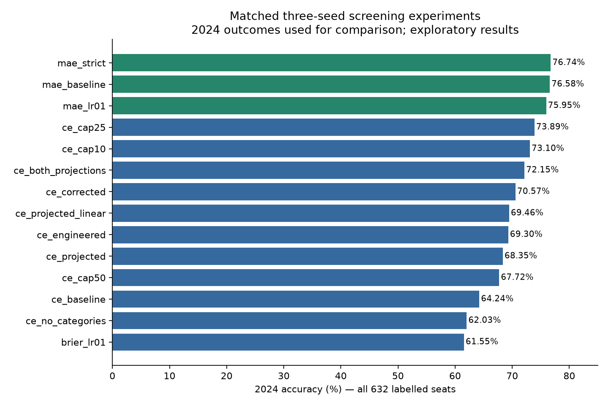

# 2024 neural-network experiments

Best final tested accuracy: **89.24% (564/632)**.
This is a **2024-tuned exploratory score**, not an independent holdout result.
2024 labels were used to compare configurations and choose the regional hybrid.
All network weight updates used elections through 2019, with half of 2019 held
out per seed. No current-election outcome columns were used as predictors.

The notebook is `../nn_fixed_learning_rate_2024.IPYNB`. Its default execution
trains three ten-seed finalists, compares projections, and runs the visible
2024 hybrid selection. `RUN_SCREENING = True` additionally reruns all fourteen
three-seed neural screens. The notebook has been executed with its default settings.

## Final comparisons

| model | accuracy | correct | changed_seat_accuracy | brier_score | log_loss |
| --- | --- | --- | --- | --- | --- |
| Selected regional hybrid (2024-tuned) | 89.24% | 564 | 85.33% | 0.2460 | 0.5255 |
| Averaged projection | 84.49% | 534 | 75.00% | 0.2981 | 0.5914 |
| mae_10_seeds | 76.58% | 484 | 60.33% | 0.4055 | 1.4106 |
| Existing projection | 76.27% | 482 | 79.67% | 0.3234 | 0.6477 |
| Vote-share swing | 74.37% | 470 | 50.00% | 0.3411 | 0.6323 |
| ce_cap10_10_seeds | 71.99% | 455 | 48.67% | 0.3863 | 0.7706 |
| ce_cap25_10_seeds | 68.20% | 431 | 36.00% | 0.4342 | 0.8125 |

The original notebook's saved ten-seed cross-entropy result was **64.40% (407/632)**;
that baseline was preserved in `original_baseline_summary.json`. It was not
freshly rerun with ten seeds during these experiments. The fresh matched
three-seed cross-entropy baseline scored 64.24%.

## Matched three-seed screening

Each screen used seeds 10011223–10011225. All default settings matched the
original notebook unless the experiment changed them: SGD, batch size 64,
32/16 ReLU hidden layers, 0.01 learning rate, 1,000 epochs maximum, patience 50,
and minimum validation-loss improvement 0.001.

| name | seeds | accuracy | mean_validation_accuracy | mean_best_epoch |
| --- | --- | --- | --- | --- |
| mae_strict | 3 | 76.74% | 84.39% | 474.3333 |
| mae_baseline | 3 | 76.58% | 83.97% | 194.3333 |
| mae_lr01 | 3 | 75.95% | 84.18% | 60.0000 |
| ce_cap25 | 3 | 73.89% | 83.65% | 24.6667 |
| ce_cap10 | 3 | 73.10% | 82.17% | 10.0000 |
| ce_both_projections | 3 | 72.15% | 91.35% | 76.3333 |
| ce_corrected | 3 | 70.57% | 93.46% | 275.6667 |
| ce_projected_linear | 3 | 69.46% | 84.28% | 14.6667 |
| ce_engineered | 3 | 69.30% | 94.83% | 358.3333 |
| ce_projected | 3 | 68.35% | 88.08% | 79.3333 |
| ce_cap50 | 3 | 67.72% | 91.56% | 49.3333 |
| ce_baseline | 3 | 64.24% | 94.73% | 365.0000 |
| ce_no_categories | 3 | 62.03% | 93.78% | 222.0000 |
| brier_lr01 | 3 | 61.55% | 95.36% | 126.3333 |

## Findings

1. **MAE helped consistently.** With matched inputs, seeds and stopping settings,
   MAE improved three-seed accuracy from 64.24% to 76.58%. MAE averages absolute
   differences between softmax probabilities and one-hot outcomes. Its different
   loss scale also changes the effective meaning of the 0.001 stopping threshold,
   so this is a comparison of training recipes, not a perfectly isolated loss test.
2. **More training was not better for 2024.** Cross-entropy capped at 25 epochs
   scored 73.89%, versus 67.72% at 50 epochs and 64.24% with original early stopping.
   Mean individual validation accuracy rose from 83.65% to 91.56% to 94.73%.
   This is consistent with a shift between the 2019 validation election and 2024.
   The mean per-network validation accuracies and ensemble test accuracies are
   different aggregations and should not be treated as a formal generalisation gap.
3. **Training MAE longer had little benefit.** Removing its minimum-improvement
   threshold, with a 500-epoch cap, scored 76.74% versus 76.58%, while the mean
   selected epoch increased from 194 to 474. Two of three runs reached the cap.
   Log loss worsened from 1.36 to 1.68. Increasing MAE's learning rate to 0.1
   reduced mean selected epochs to 60 but scored slightly lower, 75.95%.
4. **Other neural changes did not beat MAE in the screens.** Brier loss scored
   61.55%; removing previous winner, incumbent and previous majority scored
   62.03%; adding corrected projection and swing features scored 69.30%.
   A linear projection classifier scored 69.46%; supplying both projection
   versions scored 72.15%. Full configuration details are saved in JSON.
5. **Projection construction mattered more than neural tuning.** The SQL's
   previous national shares are fractions of seats won, not national vote shares.
   The existing projected-share rule scored 76.42%; substituting the unweighted
   mean of previous constituency vote shares scored 74.37%; averaging the two
   projections scored 84.49%. The unweighted mean is not an exact national vote
   share. The notebook tests this alternative locally; the SQL was not modified.
6. **Regional errors made the hybrid useful.** The averaged projection scored
   15/57 in Scotland and 519/575 elsewhere. A neural forecast improved Scotland.
   The regional gate was chosen after inspecting 2024 errors and is therefore
   explicitly part of the 2024 tuning, not an independently validated rule.

The three-seed rankings did not fully survive the ten-seed check: the 25-epoch
cross-entropy ensemble fell from 73.89% to 68.20%, while the 10-epoch ensemble
scored 71.99%. MAE remained at 76.58%. This is why the final configuration uses
ten-seed results rather than relying on a favourable three-seed screen.

## Final prediction recipe

- Neural component: `ce_cap10_10_seeds`, ten seeds 10011223–10011232.
- Projection: equal average of the existing and vote-share-based swing versions.
- Projection softmax temperature: `0.1`.
- Scotland neural weight: `0.75`; projection receives the remainder.
- Outside Scotland neural weight: `0.0`.
- All 632 labelled rows are evaluated, including imputed rows. No complete-row filtering.

The notebook compares neural weights 0, 0.25, 0.5, 0.75, 1 in Scotland and
projection temperatures 0.05, 0.1, 0.2 for all three ten-seed finalists.
The highest observed 2024 accuracy wins, with the first combination retained
on exact ties. Projection probabilities are not independently calibrated.

## Reproducibility and limits

`screening_results.csv` and `screening_training_records.csv` retain every neural
screen, including unsuccessful ones. `final_comparison.csv`,
`final_hybrid_search.csv`, `final_training_records.csv`, and `final_predictions.csv`
retain the final measurements. `environment.json` and
`selected_configuration.json` include versions, data hashes, and chosen settings.

The preliminary projection comparison used forecast-feature medians for a few
missing values; the final notebook uses historical training medians. The
averaged projection's accuracy remained 84.49% under both. The existing-only
projection changed from 76.42% to 76.27%, a difference of one seat. All neural preprocessing
is fitted only on each seed's training rows. Election-level feature means use
only prior results available before the forecast election, never 2024 outcomes.

Repeatedly selecting settings against 2024 makes its reported result optimistic
for future use. A later untouched election, or a nested historical backtest,
is needed to assess the final recipe independently. The combined `natSW` and
`oth` classes and lack of current regional nationalist polling remain limitations.
