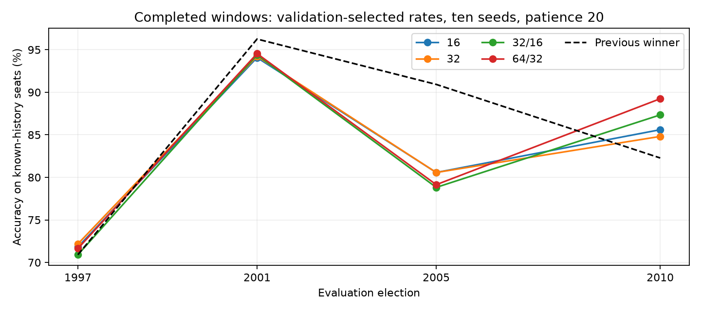

# Neural-network architecture across historical elections

**Progress report · 2026-09-23 12:26 UTC**

**The completed evidence does not identify one architecture that performs best across elections and objectives.** The main pattern is variation between elections: architecture changes are smaller than the changes in performance between historical settings. This snapshot covers **1997, 2001, 2005, 2010**, using all four architectures and ten seeds. The full extension to 2024 remains in progress (1,384 of 2,560 trajectories saved at publication).

## Findings to present

- **1997 is poorly captured as a change election.** Selected architectures identify only 5.0–6.25% of changed seats correctly. On the 550 constituencies with known previous winners, accuracy is 70.91–72.18%, against 70.91% for predicting the previous winner. A further 91 missing-history seats materially reduce all-seat accuracy.
- **High accuracy in 2001 largely reflects stable seats.** The selected models achieve 94.07–94.54% overall accuracy, below the previous-winner baseline of 96.26%. Only 24 seats change winner in the supplied data.
- **2005 exposes the cost of false changes.** Selected models identify 61.40–63.16% of changed seats correctly, but overall accuracy is only 78.82–80.57%, against 90.92% for the baseline. The models call too many changes on seats that actually hold.
- **2010 favours the larger network, but still shows seat-total bias.** The 64/32 architecture reaches 89.24% accuracy, versus 87.34% for 32/16 and 82.28% for the previous-winner baseline. Its 93 correctly predicted changes exceed its 49 false changes. All four architectures nevertheless overpredict Conservative seats. This election-specific advantage does not establish that the larger architecture is preferable in every period.
- **The smaller learning-rate search does not reproduce every full-search choice.** All architectures select rate 1.0 in 1997 and 2001; the original three-window recommendation restricted search to 0.1, 0.2, 0.3 and 0.5. This does not establish that rate 1.0 should be used universally.

## Accuracy by election

Percentages below use all supplied evaluation rows. Each architecture selects its rate on the preceding validation election, so differences include both architecture and rate.

| election | 16 | 32 | 32_16 | 64_32 |
| --- | --- | --- | --- | --- |
| 1997 | 68.64 | 68.95 | 67.86 | 68.49 |
| 2001 | 94.07 | 94.23 | 94.38 | 94.54 |
| 2005 | 80.57 | 80.57 | 78.82 | 79.14 |
| 2010 | 85.60 | 84.81 | 87.34 | 89.24 |

## Correctly predicted changes

Percentage of changed seats for which the model predicts the correct new party. Rows with missing previous winners are excluded.

| election | 16 | 32 | 32_16 | 64_32 |
| --- | --- | --- | --- | --- |
| 1997 | 5.62 | 6.25 | 5.00 | 5.62 |
| 2001 | 12.50 | 12.50 | 16.67 | 4.17 |
| 2005 | 61.40 | 61.40 | 61.40 | 63.16 |
| 2010 | 83.04 | 86.61 | 84.82 | 83.04 |

## Average performance on completed windows

Each election receives equal weight. The overall/changed score averages the two accuracy measures, matching the pipeline selector up to a factor of two. Lower log loss indicates better probability predictions. These averages are provisional and exclude incomplete windows.

| architecture | mean_accuracy | mean_changed_accuracy | mean_overall_changed_score | mean_log_loss |
| --- | --- | --- | --- | --- |
| 16 | 82.22 | 40.64 | 61.43 | 0.53 |
| 32 | 82.14 | 41.69 | 61.92 | 0.54 |
| 32_16 | 82.10 | 41.97 | 62.04 | 0.57 |
| 64_32 | 82.85 | 39.00 | 60.92 | 0.53 |

## Comparison with predicting the previous winner

Both methods are evaluated on the same known-history rows. A positive gain favours the network. Correct changes minus false changes is the net number of additional correct predictions against this baseline.

| election | architecture | rate | known_accuracy | baseline_known | known_gain_pp | correct_changes | false_changes |
| --- | --- | --- | --- | --- | --- | --- | --- |
| 1997 | 16 | 1.00 | 71.82 | 70.91 | 0.91 | 9 | 4 |
| 1997 | 32 | 1.00 | 72.18 | 70.91 | 1.27 | 10 | 3 |
| 1997 | 32_16 | 1.00 | 70.91 | 70.91 | 0.00 | 8 | 8 |
| 1997 | 64_32 | 1.00 | 71.64 | 70.91 | 0.73 | 9 | 5 |
| 2001 | 16 | 1.00 | 94.07 | 96.26 | -2.18 | 3 | 17 |
| 2001 | 32 | 1.00 | 94.23 | 96.26 | -2.03 | 3 | 16 |
| 2001 | 32_16 | 1.00 | 94.38 | 96.26 | -1.87 | 4 | 16 |
| 2001 | 64_32 | 1.00 | 94.54 | 96.26 | -1.72 | 1 | 12 |
| 2005 | 16 | 0.20 | 80.57 | 90.92 | -10.35 | 35 | 100 |
| 2005 | 32 | 0.50 | 80.57 | 90.92 | -10.35 | 35 | 100 |
| 2005 | 32_16 | 0.20 | 78.82 | 90.92 | -12.10 | 35 | 111 |
| 2005 | 64_32 | 0.20 | 79.14 | 90.92 | -11.78 | 36 | 110 |
| 2010 | 16 | 1.00 | 85.60 | 82.28 | 3.32 | 93 | 72 |
| 2010 | 32 | 1.00 | 84.81 | 82.28 | 2.53 | 97 | 81 |
| 2010 | 32_16 | 1.00 | 87.34 | 82.28 | 5.06 | 95 | 63 |
| 2010 | 64_32 | 1.00 | 89.24 | 82.28 | 6.96 | 93 | 49 |

## Fixed learning rate: a cleaner architecture comparison

All architectures use rate 0.3 and patience 20. Differences still reflect optimisation and model capacity; they do not prove a causal benefit from adding layers.

| election | 16 | 32 | 32_16 | 64_32 |
| --- | --- | --- | --- | --- |
| 1997 | 68.49 | 68.49 | 67.86 | 68.17 |
| 2001 | 94.54 | 94.54 | 92.04 | 92.20 |
| 2005 | 80.25 | 78.82 | 79.78 | 79.46 |
| 2010 | 83.70 | 83.39 | 84.49 | 85.76 |

## Party seat totals

Counts cover the supplied Great Britain rows, not the entire UK Parliament. `natSW` combines SNP and Plaid Cymru; `oth` pools other parties. These are argmax seat totals, not probabilities of a parliamentary majority.

### 1997

| party | actual | 16 | 32 | 32_16 | 64_32 |
| --- | --- | --- | --- | --- | --- |
| con | 166 | 363 | 362 | 364 | 363 |
| lab | 418 | 268 | 266 | 271 | 269 |
| lib | 45 | 6 | 6 | 6 | 6 |
| natSW | 10 | 4 | 7 | 0 | 3 |
| oth | 2 | 0 | 0 | 0 | 0 |

### 2001

| party | actual | 16 | 32 | 32_16 | 64_32 |
| --- | --- | --- | --- | --- | --- |
| con | 166 | 187 | 186 | 186 | 178 |
| lab | 412 | 418 | 418 | 419 | 419 |
| lib | 52 | 26 | 27 | 28 | 34 |
| natSW | 9 | 10 | 10 | 8 | 10 |
| oth | 2 | 0 | 0 | 0 | 0 |

### 2005

| party | actual | 16 | 32 | 32_16 | 64_32 |
| --- | --- | --- | --- | --- | --- |
| con | 198 | 301 | 301 | 312 | 313 |
| lab | 355 | 279 | 281 | 270 | 271 |
| lib | 62 | 38 | 36 | 36 | 35 |
| natSW | 9 | 10 | 10 | 10 | 9 |
| oth | 4 | 0 | 0 | 0 | 0 |

### 2010

| party | actual | 16 | 32 | 32_16 | 64_32 |
| --- | --- | --- | --- | --- | --- |
| con | 306 | 375 | 391 | 369 | 353 |
| lab | 258 | 208 | 204 | 224 | 234 |
| lib | 57 | 43 | 32 | 32 | 38 |
| natSW | 9 | 6 | 5 | 7 | 7 |
| oth | 2 | 0 | 0 | 0 | 0 |

## Relationship to the completed original study

The earlier three-election study separately covered 2005, 2015 and 2019. Its ten-seed 32/16 procedure with full validation-based rate selection and patience 20 achieved 78.82%, 78.80% and 90.19% accuracy respectively. Its mean accuracy was 82.60%, versus 87.22% for the previous-winner baseline. These are prior saved results, not a claim that the current all-architecture extension has finished those later elections. See [the original report](REPORT_three_elections.md).

## Interpretation and next decision

Retain 32/16 as a reference candidate while the full comparison finishes. The current evidence does not support increasing network size as a general solution. Judge a candidate using overall accuracy, correctly predicted changes, false changes, party totals and log loss together. The existing pipeline gives equal weight to overall and changed-seat accuracy; both components are preserved in the accompanying CSV, along with their equally weighted score.

Before changing the architecture, investigate data representation in a separate controlled experiment: 91 missing-history rows in 1997; national polling features that are constant in the earliest training window; and 115 rows in 2024 whose region names are unseen in training because of naming differences. These identify possible failure mechanisms, not demonstrated causes. No feature corrections have been introduced into this comparison.

## Method and limits

Each window trains through a cutoff, validates on the next whole election and evaluates on the following one. Preprocessing is fitted on training rows only. Architectures are 16, 32, 32/16 and 64/32 ReLU units; SGD rates are 0.01, 0.03, 0.05, 0.1, 0.2, 0.3, 0.5 and 1.0. This report uses ten-seed probability ensembles and patience 20, with each seed restoring its lowest validation-loss checkpoint. The full run also evaluates patience 10 and 50.

This is retrospective development evidence, including previously inspected elections. Ten seeds measure optimisation variability, not ten independent elections. Early evaluation windows have little training history, and later windows reuse earlier elections. The supplied features and boundary mappings have not received a fresh historical-availability audit. This snapshot has checked complete-window coverage, probability validity and the matching-row baseline accounting identity; the full saved-table audit and leave-one-election-out summaries remain pending.

## Files and resumption

- [Completed-window metrics](all_elections/completed_window_metrics.csv)
- [Party seat counts](all_elections/completed_window_party_counts.csv)
- [Original three-election report](REPORT_three_elections.md)
- [All-election notebook](../09_nn_architecture_all_elections.IPYNB) — full result cells remain pending.

Checkpoints now live in `.nn_study_cache/` inside the workspace. After an interruption, run `python "Analysis and model development/nn_architecture_study/resume_all_elections.py"` using the repository environment. It resumes missing fits, builds the diagnostics and runs the audit. Do not start a duplicate runner while training is active.

