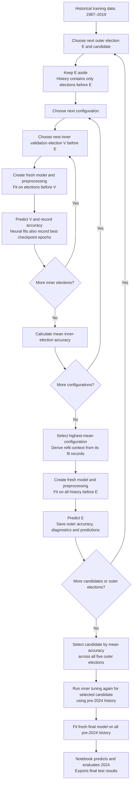
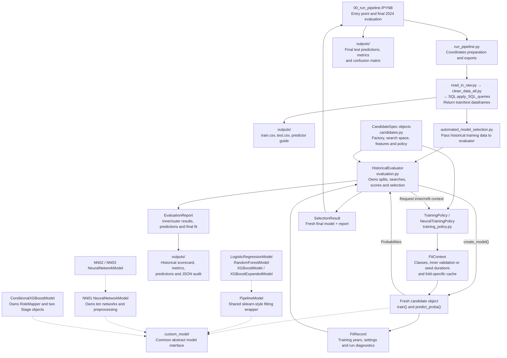

# The nested election prediction pipeline

This guide combines the model development specification and the module explainer. It describes the implemented pipeline: how nested cross-validation selects a modelling procedure, how the model objects work, and what each file does.

## Reading guide

- [Nested cross-validation](#nested-cross-validation): the two loops and their flowchart.
- [Model specifications](#model-specifications): the settings searched and held fixed.
- [Modules and objects](#modules-and-objects): the pipeline flowchart and object lifecycle.
- [The eight model candidates](#the-eight-model-candidates): file-by-file explanations.
- [Shared model and preprocessing code](#shared-model-and-preprocessing-code): the supporting classes.
- [Model registration and evaluation](#model-registration-and-evaluation): registration, reports and selection.

## What the pipeline predicts

Each model estimates the probability that a Great Britain constituency will be won by Conservative, Labour, Liberal Democrat, SNP/Plaid Cymru or Other. The party with the highest probability becomes the predicted winner.

Constituency identifiers support joins and reporting. Election year controls chronological splitting and missing-data handling. Neither is supplied to the estimator as a predictor.

A **candidate** is a complete modelling procedure: its predictors, preprocessing, model architecture, search space, fixed settings, training policy and probability-combination rules. Historical evaluation compares these procedures. Each date can produce different selected settings and a different fitted model.

## Nested cross-validation

The pipeline uses **nested expanding-window cross-validation**, also called nested walk-forward validation. Whole elections form the folds, and training always uses earlier elections.

The **inner loop** chooses settings. For each configuration and inner validation election V, fit using elections before V, predict V, and measure accuracy. Average the accuracies with equal weight for each inner election. Select the configuration with the highest mean.

The **outer loop** measures the tuned procedure. For an outer election E, run the inner search using only history before E. Fit a fresh model on all that history using the selected settings, then predict E. E's outcomes are used only for scoring this forecast.

### Cross-validation flowchart



The loops create fresh model instances when fitting is required. Identical inner scores and fit records can be reused from an in-memory cache; conditional stages can also be reused within the same fold. Reuse does not move later data into an earlier forecast.

### Election schedule

| Outer election E | Inner validation elections V | History used for outer refit |
|---|---|---|
| 2005 | 1997, 2001 | 1987–2001 |
| 2010 | 1997, 2001, 2005 | 1987–2005 |
| 2015 | 1997, 2001, 2005, 2010 | 1987–2010 |
| 2017 | 1997, 2001, 2005, 2010, 2015 | 1987–2015 |
| 2019 | 1997, 2001, 2005, 2010, 2015, 2017 | 1987–2017 |
| Final 2024 fit, after candidate selection | 1997, 2001, 2005, 2010, 2015, 2017, 2019 | 1987–2019 |

Ranges refer to the available general elections within those dates. For each V, the inner training set contains only elections before V. Every scheduled inner fold requires at least two earlier training elections.

For example, the 2005 forecast tunes each configuration using two fits: train on 1987 and 1992 to predict 1997, then train on 1987, 1992 and 1997 to predict 2001. After choosing settings, it fits afresh through 2001 and predicts 2005.

A previous outer election legitimately becomes history for a later forecast. Its saved forecast remains the prediction made using the earlier information boundary.

### Selection and interpretation

```text
configuration score = mean accuracy across inner validation elections

candidate score = (accuracy_2005 + accuracy_2010 + accuracy_2015
                   + accuracy_2017 + accuracy_2019) / 5
```

Each election has equal weight regardless of its constituency count. Changed-seat accuracy, latest-three mean and other diagnostics do not alter selection. Exact candidate ties follow registry order; exact configuration ties follow generated configuration order. There is no practical-tie threshold.

All candidates predict the same rows with known winners. Missing predictors are imputed rather than used to exclude difficult evaluation rows. Missing scheduled folds or fitting failures abort the comparison.

Learned preprocessing follows the same boundary as model fitting: training medians, category encodings, scaling and role mapping are fitted only on the relevant training history. Outer refits learn these afresh. Held-out outcomes do not determine settings or refit duration.

Early outer elections have less tuning evidence. The five-election mean measures a procedure as available history grows, rather than one fixed fitted model. Constituencies share national election conditions, and folds share historical data, so thousands of rows do not represent thousands of independent election environments.

The outer results also select the candidate. They are evidence for that selection, rather than a separate untouched assessment of the selected winner. The 2024 evaluation is retrospective: its results are already known and have informed project development.

## Model specifications

The current searches are defined in [candidates.py](Models/candidates.py). Every configuration is evaluated across all scheduled inner elections available at that forecast date.

| Candidate | Settings searched | Configurations |
|---|---|---|
| Logistic regression | `C`: 0.01, 0.1, 1, 10 | 4 |
| Random forest | `max_depth`: 5, 10, unrestricted; `min_samples_leaf`: 1, 5, 10; `max_features`: square root, 0.5 | 18 |
| XGBoost | `n_estimators`: 20, 35, 50, 100; `max_depth`: 2, 3, 4, 5 | 16 |
| XGBoost Expanded | Same tree-count/depth search, tuned independently | 16 |
| Conditional XGBoost | Each stage independently searches 25, 50, 100, 200 trees and depths 2, 3, 4, 5; pairs scored jointly | 256 |
| NN01 | Hidden layers fixed at 32/16; learning rates: 0.1, 0.2, 0.3, 0.5 | 4 |
| NN02 | Hidden layers fixed at 64/32; learning rates: 0.01, 0.03, 0.05, 0.1, 0.2, 0.3, 0.5, 1.0 | 8 |
| NN03 | Hidden layer fixed at 16; learning rate fixed at 0.3 | 1 |

A configuration count is not a total fit count: configurations are tested across several inner elections and outer dates. NN03 still runs the inner folds to derive training durations.

### Fixed settings

**Logistic regression:** L2 regularisation, `lbfgs`, 1,000 maximum iterations, tolerance 0.0001 and no class weighting. Numeric inputs are standardised. Convergence warnings cause fitting to fail.

**Random forest:** 300 trees, minimum split size 2, bootstrap sampling enabled, Gini criterion, no class weighting, random seed 42 and one worker.

**Boosted trees, including conditional stages:** learning rate 0.05, minimum child weight 1, split-gain threshold 0, full row/predictor sampling, L1 regularisation 0, L2 regularisation 1, histogram tree method, seed 42 and one worker. Tree count is selected directly, with no validation-based early stopping. Ordinary XGBoost predicts class probabilities; conditional stages use binary or multiclass objectives according to their observed labels.

**Neural candidates:** ten networks with seeds 101223–101232, ReLU hidden activations, cross-entropy loss, stochastic gradient descent, batch size 64, zero momentum, zero weight decay and no dropout. Their probabilities are averaged before scoring.

### Neural checkpoints and refit durations

During an inner fit, each seed trains for up to 1,000 epochs. After each epoch, it measures log loss on V. Any strictly lower loss counts as improvement; after 20 epochs without improvement, training stops and restores the lowest-loss checkpoint.

Log loss chooses checkpoints. Mean inner-election accuracy chooses the learning rate. The inner validation election participates in both decisions, so its accuracy is tuning evidence.

For each seed, take the median best-checkpoint epoch across inner folds for the selected configuration, round halves up and enforce at least one epoch. Fit fresh networks and preprocessing on all history before E for those durations. No validation election is reserved during this refit, and no outer outcomes are monitored.

### Conditional stage selection

The change stage trains on all training seats; the challenger stage trains on changed seats only. Their joint winner probabilities are scored on all validation rows. The 256 combinations therefore optimise the complete candidate, rather than independently selecting stages by different objectives.

Identical stage fits are cached within a fold. A fold with no changed training seats fails explicitly. A validation election without changed seats still contributes overall accuracy; its changed-seat diagnostic is unavailable.

## Modules and objects

The pipeline combines function-based data preparation with object-oriented model fitting and evaluation. The preparation functions produce dataframes. Model objects retain fitted state; the evaluator manages chronology and selection; report objects retain the evidence.

### Module and object flowchart

Solid arrows below show calls or data/results passed between components. Dotted arrows show inheritance: the subclass inherits from the class it points to.



The fresh candidate object is one of the concrete model classes shown at the bottom. Both the abstract interface and concrete adapters are explained below.

### Object-oriented responsibilities

| Object | Responsibility | State it retains |
|---|---|---|
| `CandidateSpec` | Describes a reusable candidate and constructs fresh models | Factory, search space, fixed settings, feature list, training policy and version |
| `HistoricalEvaluator` | Runs the two loops, checks inputs, chooses settings and selects the candidate | Current report and in-memory inner-result cache |
| `custom_model` subclass | Fits one supplied configuration and predicts from fitted state | Name, classes, fitted settings, preprocessing, estimator/stages/networks and its fit record |
| `TrainingPolicy` | Builds fitting contexts for ordinary models | Policy definition/version |
| `NeuralTrainingPolicy` | Supplies inner validation and derives per-seed refit durations | Policy definition/version |
| `FitContext` | Carries fitting inputs beyond the training dataframe | Classes, optional inner validation, seed durations and fold-scoped cache |
| `FitRecord` | Describes one completed fit independently of its model | Training years, configuration, validation year and per-run diagnostics |
| `EvaluationReport` | Holds the historical comparison and final-fit audit | Scores, diagnostics, predictions, metadata, status and final-fit details |
| `SelectionResult` | Returns the fitted model alongside its report | `model` and `report`; exposes `model_name` |

**Inheritance** shares behaviour. `PipelineModel` implements the repeated fitting wrapper for four ordinary candidates. NN02 and NN03 inherit the neural implementation from NN01 and supply their own architectures and learning rates.

**Polymorphism** gives the evaluator one interface. It calls `train()` and `predict_proba()` regardless of whether the candidate contains a logistic classifier, a forest, ten networks or two conditional stages. It does not need neural-model type checks: the training policy supplies the appropriate context.

**Composition** lets an object own other objects. A pipeline model owns a fitted sklearn pipeline containing preprocessing and a classifier. A neural model owns networks and preprocessors. A conditional model owns a role mapper and two fitted stages. An evaluator uses candidate specifications and their policy objects.

**Encapsulation** keeps fitting details in each candidate. The evaluator manages elections and scoring, while the model manages its own preprocessing and estimator state. `EvaluationReport` stores comparison evidence separately from the returned model.

### Lifecycle of one fitted model

1. `spec.create_model()` constructs a fresh object. Its estimator, stages or networks are initially unfitted.
2. The evaluator supplies training rows, one configuration and a `FitContext`.
3. `model.train(...)` updates that object's fitted state and returns a detached `FitRecord` copy.
4. `model.predict_proba(...)` applies its stored transformations and fitted estimator. Prediction performs no fitting.
5. The evaluator stores scores and records separately in its report.
6. After selecting a configuration, the evaluator constructs a fresh refit object. Inner weights and fitted preprocessing are not copied into it.
7. After selecting a candidate, it tunes again and creates the fresh final model returned in `SelectionResult`.

The candidate definition describes what may be tried; the fitted model records what was actually used. Choosing settings does not mutate an already fitted model.

### Outputs and audit records

All default exports live in `00_pipeline/outputs/`. `run_pipeline(output_dir=...)` redirects the pipeline's datasets, guide and historical reports together. The notebook uses its `output_directory` for final evaluation exports too.

| Output | Producer and contents |
|---|---|
| `train.csv`, `test.csv` | Pipeline: historical training rows and 2024 test rows |
| `predictor_descriptions.md` | Pipeline: exported column meanings and missing-value conventions |
| `model_accuracies.csv` | `EvaluationReport`: five-election scorecard, means, ranges and diagnostics |
| `model_accuracies_elections.csv` | `EvaluationReport`: outer-election metrics and fitting details |
| `model_accuracies_predictions.csv` | `EvaluationReport`: historical constituency predictions and party probabilities |
| `model_accuracies_report.json` | `EvaluationReport`: inner searches, metadata, status and final fit |
| `test_predictions.csv` | Notebook: final test rows with predicted winners |
| `test_metrics.json` | Notebook: final accuracy and evaluation row counts |
| `test_confusion_matrix.csv`, `test_confusion_matrix.png` | Notebook: final confusion matrix as data and an image |

The final fitted model remains in memory. Reports record package versions, source/data digests, settings, training years, seeds and neural duration details. They are marked `incomplete`, `failed` or `complete`. A failed run retains available evidence and does not return a winner from a reduced comparison.

Diagnostics include changed/retained-seat accuracy and counts, macro-F1, log loss, per-party seat errors, the previous-winner baseline, neural seed variability, latest-three means and leave-one-election-out winners. Empty changed/retained slices are unavailable rather than zero. These diagnostics help assess a ranking without changing the primary selection rule.


## The eight model candidates

### logistic_regression.py

[Open the file](Models/model_candidates/logistic_regression.py).

Logistic regression learns a weighted relationship between the predictors and each party's chance of winning. For example, a higher previous Labour vote share might increase the estimated probability of a Labour win.

Before fitting, the file:

- Converts numeric predictors to consistent numeric types.
- Fills missing values using training data.
- Converts categories, such as region and previous winner, into indicator columns.
- Standardises numeric predictors so they have comparable scales.

It uses L2 regularisation, which discourages excessively large weights. The evaluator tries four values of `C`: 0.01, 0.1, 1 and 10. Smaller values apply stronger regularisation.

The candidate trains on all five party categories, including Other.

### random_forest.py

[Open the file](Models/model_candidates/random_forest.py).

A random forest combines 300 decision trees. Each tree learns rules that divide constituencies into groups, using sampled training rows and subsets of predictors. The forest averages the trees' probabilities.

Unlike logistic regression, trees can naturally learn relationships involving several conditions. A rule might depend on both previous vote share and national polling.

This file fills missing inputs and encodes categories before fitting. Numeric inputs do not need standardisation.

The evaluator tries 18 combinations of:

- Maximum tree depth.
- Minimum number of training rows in a leaf.
- Number of predictors considered at each split.

The random seed is fixed at 42 for reproducibility.

### xgboost_model.py

[Open the file](Models/model_candidates/xgboost_model.py).

This candidate uses boosted decision trees with the standard set of 14 predictors: region, previous winner and vote shares, national polling, the governing party and projected shares.

Boosting adds trees sequentially, with each new tree helping improve the current predictions.

This file declares the predictors and model name. It delegates preprocessing and fitting to `boosting.py`.

The evaluator tries 16 combinations: 20, 35, 50 or 100 trees, each with a maximum depth of 2, 3, 4 or 5. The learning rate is fixed at 0.05.

### xgboost_expanded_model.py

[Open the file](Models/model_candidates/xgboost_expanded_model.py).

This uses the same boosted-tree implementation as standard XGBoost, with a larger predictor set.

Additional inputs include previous national vote shares, the previous first–second margin, national changes, support for the governing party, and holder/challenger polling and swings.

It tests the same 16 tree-count and depth combinations, but its settings are selected independently of the standard XGBoost candidate.

### conditional_xgboost_model.py

[Open the file](Models/model_candidates/conditional_xgboost_model.py).

This candidate breaks constituency prediction into two questions:

1. Will the seat change party?
2. If it changes, which challenger will win?

The first classifier trains on all training seats. The second trains only on seats that changed party.

The file also rearranges party features into constituency-specific roles: previous winner, strongest challenger, next challenger, and so on. This lets the model learn patterns about defending and challenging a seat across different parties.

In this role mapping, **incumbent means the previous constituency winner**. The national governing party is a separate input.

The two stages produce a single set of winner probabilities:

```text
Previous winner probability = 1 − probability of change

Challenger probability = probability of change
                        × probability that challenger wins given change
```

For example, suppose the probability of change is 60%, and Labour has a 70% conditional chance of winning among the challengers. Labour receives a final probability of 42%, while the previous winner receives 40%. The remaining 18% is distributed among the other challengers.

The evaluator compares 256 pairs of stage settings using the accuracy of the combined winner predictions. Within a historical fold, identical stage fits can be reused to reduce computation. A training fold with no changed seats fails explicitly.

### NN01_model.py

[Open the file](Models/model_candidates/NN01_model.py).

This file contains the shared neural-network implementation and the NN01 candidate.

NN01 has two hidden layers containing 32 and 16 neurons. These layers learn combinations of predictors and nonlinear relationships before producing probabilities for the five parties.

It uses the same predictors as logistic regression. Numeric inputs are filled and standardised; categories are encoded as indicator columns.

Each fit trains ten networks with different fixed random seeds. Their predicted probabilities are averaged to produce the ensemble prediction.

Training uses stochastic gradient descent and cross-entropy loss. The evaluator compares learning rates of 0.1, 0.2, 0.3 and 0.5.

During historical inner validation, each network retains the checkpoint with the lowest validation log loss. Training stops after 20 epochs without improvement, or at the 1,000-epoch limit. An epoch is one pass through the training data.

During a later refit, each network trains for a fixed duration derived from its historical checkpoints. It does not monitor the election being predicted.

### NN02_model.py

[Open the file](Models/model_candidates/NN02_model.py).

This file reuses the implementation in `NN01_model.py`, but changes the hidden layers to 64 and 32 neurons.

It compares eight learning rates: 0.01, 0.03, 0.05, 0.1, 0.2, 0.3, 0.5 and 1.0.

It still averages ten networks and follows the same checkpoint and refit rules. The file is short because it inherits the training and prediction code.

### NN03_model.py

[Open the file](Models/model_candidates/NN03_model.py).

This also reuses the implementation in `NN01_model.py`. It uses one hidden layer containing 16 neurons and a fixed learning rate of 0.3.

There is no learning-rate search for this candidate. Historical validation still determines how long each of its ten networks should train during refitting.

## Shared model and preprocessing code

### custom_model.py

[Open the file](Models/custom_model.py).

This defines the common interface that all model candidates follow:

- `train()` fits one supplied configuration.
- `predict_proba()` returns party probabilities.
- `predict()` chooses the party with the highest probability.

It also defines two records:

- `FitContext` carries information needed for a fit, such as validation data, per-seed training durations or a fold-specific cache.
- `FitRecord` records the training elections, settings and training diagnostics.

The file checks that training rows have valid labels and that any validation election comes after the training elections. It aligns probability columns to the common order: `con`, `lab`, `lib`, `natSW`, `oth`. Ordinary classifiers assign zero probability to classes absent from their training data.

### pipeline_model.py

[Open the file](Models/pipeline_model.py).

This provides shared behaviour for logistic regression, random forest, standard XGBoost and expanded XGBoost.

It combines model defaults with supplied settings, calls the candidate's fitting function, retains the fitted preprocessing/classifier pipeline and records the fit.

For prediction, it selects the declared inputs, applies the fitted pipeline and aligns the returned party probabilities. This avoids repeating the same supporting code in each candidate.

### boosting.py

[Open the file](Models/boosting.py).

This builds the preprocessing and XGBoost pipeline used by standard and expanded XGBoost.

It fills missing values, encodes categories and converts party names into numeric class labels for XGBoost. Predicted classes are then mapped back to party names.

It contains shared boosted-tree defaults, including a learning rate of 0.05 and random seed of 42. Supplied configurations override these defaults.

If training data contains only one party, it returns that party with probability 1 rather than attempting a multi-party fit.

The conditional model shares the defaults but implements its own stage fitting in `conditional_xgboost_model.py`.

### missing_data.py

[Open the file](Models/missing_data.py).

This implements `ElectionImputer`, which learns missing-value replacements from training data.

Numeric gaps use training-data medians. Entirely missing numeric columns use zero.

For a missing previous winner, it prefers the most common winning party from the preceding available training election. For the earliest training election, it uses the known previous-winner information, with a broader historical fallback if needed.

The fitted replacements are reused during prediction. Prediction outcomes are never inspected to fill missing inputs. Other preprocessing steps handle missing categories with a named missing-value marker.

### training_policy.py

[Open the file](Models/training_policy.py).

This controls what information models receive during inner fitting and later refitting.

`TrainingPolicy` is used for ordinary models. These models fit on all supplied training rows without needing validation outcomes during fitting. The evaluator scores their predictions separately.

`NeuralTrainingPolicy` supplies an inner validation election so networks can choose checkpoints. For refitting, it calculates each seed's median best epoch across the selected configuration's inner folds, rounds halves up and enforces a minimum of one epoch.

The fresh refit then trains on all available history for those durations, without validation monitoring.

## Model registration and evaluation

### candidates.py

[Open the file](Models/candidates.py).

This is the central registry of the eight candidates.

Each `CandidateSpec` declares:

- The candidate's name.
- A factory that creates a fresh model instance.
- The settings to search and settings that remain fixed.
- The predictor columns required.
- The training policy to use.

`configurations()` generates the combinations of settings to try. `create_model()` creates a fresh instance and checks its name.

To add another candidate to the default comparison, implement its model class and register it here. Callers can also pass a custom candidate list directly to the pipeline.

### evaluation.py

[Open the file](Models/evaluation.py).

This coordinates historical tuning, comparison, selection and final refitting.

The default evaluation elections are **2005, 2010, 2015, 2017 and 2019**. Each candidate forecasts each of these elections using only earlier data.

For example, when forecasting 2015:

1. Try configurations using earlier historical validation elections.
2. Select the configuration with the highest mean validation accuracy.
3. Fit a fresh model on all available history before 2015.
4. Predict 2015 and record the results.

This is nested walk-forward validation: settings are chosen within the earlier history, while the later election measures the tuned procedure's performance.

The candidate with the highest mean accuracy across the five evaluation elections wins. Each election receives equal weight. Changed-seat accuracy is reported as a diagnostic and receives no extra selection weight. Exact ties follow the candidate or configuration order.

The winning candidate is then tuned again on pre-2024 history and fitted afresh for the 2024 prediction. Historical fitted models are not averaged into the final model.

For neural candidates, checkpoint selection uses log loss, which measures probability quality. Configuration and candidate selection still use accuracy.

The file also:

- Checks required columns, chronology and party labels.
- Ensures probabilities are finite, nonnegative and sum to one.
- Calculates accuracy, changed/retained-seat accuracy, macro-F1, log loss, party seat errors and the previous-winner baseline.
- Records neural seed diagnostics and historical constituency predictions.
- Caches identical inner fits within a run to reduce repeated work.
- Records data/code fingerprints, package versions and fitting settings.
- Saves the scorecard, election-level results, predictions and JSON audit.

Reports have `incomplete`, `failed` or `complete` status. A fitting failure saves the available audit information and aborts the comparison.

The returned `SelectionResult` contains the fitted model and its evaluation report.

**Final 2024 scoring happens in the pipeline notebook, outside this file.** The notebook exports final test predictions, metrics and the confusion matrix to `00_pipeline/outputs/`.

### README.md

[Open the file](Models/README.md).

This documents the model interface, historical evaluation rules, training/refitting behaviour, report contents and steps for adding a model. It does not execute anything.

### __pycache__/

This directory contains automatically generated Python bytecode. It has no modelling logic to maintain.

## Where to start reading

Read `candidates.py` to see what is compared, then `evaluation.py` to understand how the comparison works. Read an individual model file to understand its fitting behaviour.

For neural networks, most of the implementation is in `NN01_model.py`. For standard and expanded XGBoost, the shared fitting implementation is in `boosting.py`.
