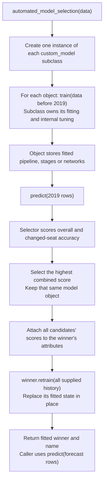

# Model development plan

Saved from the project discussion on 30 September 2026. These are proposed next steps, not implemented changes or new experimental results.

## Proposed models and hyperparameters

The comparison will select among eight candidates using **mean accuracy across five outer elections: 2005, 2010, 2015, 2017 and 2019**, with each election receiving equal weight. The specifications below describe the proposed procedure, not an inventory of current configurations. The suggested search values are starting proposals to freeze before running the comparison; they are not experimentally established best settings.

**Highlight key:** <span style="background-color: #dcfce7; color: #166534;">🟩 New suggestion</span> · <span style="background-color: #f3e8ff; color: #6b21a8;">🟪 Already used</span>.

Colours classify the proposed setting or search, not just the parameter name. Green includes newly searched parameters, changed values and newly explicit controls previously left to library defaults. Purple identifies settings explicitly configured or implemented in the model code. A green search can include a value already used by default. Colours do not imply that the proposed fold schedule is already implemented. The square markers preserve the distinction in Markdown viewers that remove inline colours.

For every model below, **E** means the outer election being evaluated and **V** means an inner validation election earlier than E. Each inner fit uses only elections before V. Hyperparameters are chosen using the mean inner-election score, then a fresh model is fitted using history before E and evaluated on E. Repeat this independently for all five outer elections; the five outer scores choose the candidate, not one common hyperparameter configuration for every date.

| Outer election E | Inner validation elections V | History available for the outer refit |
|---|---|---|
| 2005 | 1997, 2001 | 1987–2001 |
| 2010 | 1997, 2001, 2005 | 1987–2005 |
| 2015 | 1997, 2001, 2005, 2010 | 1987–2010 |
| 2017 | 1997, 2001, 2005, 2010, 2015 | 1987–2015 |
| 2019 | 1997, 2001, 2005, 2010, 2015, 2017 | 1987–2017 |

Ranges mean the available elections within those dates. For example, for E = 2019 and V = 2017, fit on elections through 2015 and score on 2017. The 2019 outcomes play no part in this choice. This schedule applies to every candidate, subject to the historical-data checks below.

### Logistic regression

A multinomial classifier that predicts winning-party probabilities from the baseline predictors.

| Hyperparameter or training setting | Proposed values and use in the inner folds | Use before predicting E |
|---|---|---|
| <span style="background-color: #dcfce7; color: #166534;">🟩 Inverse regularisation strength (<code>C</code>)</span> | Search 0.01, 0.1, 1, 10; lower values impose stronger regularisation. Fit each value before each V and select by mean accuracy on V. | Refit on all history before E using the selected C. |
| <span style="background-color: #dcfce7; color: #166534;">🟩 Regularisation (<code>penalty</code>)</span> | Fix L2 for this candidate. | Retain L2. |
| <span style="background-color: #f3e8ff; color: #6b21a8;">🟪 Optimisation solver (<code>solver</code>)</span> | Fix `lbfgs`. | Use the same solver. |
| <span style="background-color: #f3e8ff; color: #6b21a8;">🟪 Iteration cap (<code>max_iter</code>)</span> | Fix 1,000; check convergence on each fit. | Apply the same cap and check convergence. |
| <span style="background-color: #dcfce7; color: #166534;">🟩 Convergence tolerance (<code>tol</code>)</span> | Explicitly fix 0.0001, previously left to the library default. | Apply the same tolerance. |
| <span style="background-color: #dcfce7; color: #166534;">🟩 Class weighting (<code>class_weight</code>)</span> | Fix no class weighting. | Retain the same rule. |

Learn imputation, encoding and numeric scaling separately from each inner training set, then learn them afresh from all history before E for the outer refit.

### Random forest

An ensemble of decision trees using the baseline predictors.

| Hyperparameter or training setting | Proposed values and use in the inner folds | Use before predicting E |
|---|---|---|
| <span style="background-color: #dcfce7; color: #166534;">🟩 Tree count (<code>n_estimators</code>)</span> | Fix 300 to bound computation consistently. | Fit 300 fresh trees on history before E. |
| <span style="background-color: #dcfce7; color: #166534;">🟩 Maximum depth (<code>max_depth</code>)</span> | Search 5, 10, unrestricted. | Use the depth selected by mean inner accuracy. |
| <span style="background-color: #dcfce7; color: #166534;">🟩 Minimum rows per leaf (<code>min_samples_leaf</code>)</span> | Search 1, 5, 10. | Use the selected minimum leaf size. |
| <span style="background-color: #dcfce7; color: #166534;">🟩 Predictors considered per split (<code>max_features</code>)</span> | Search square root of predictor count and 0.5 of predictors. | Use the selected feature-sampling rule. |
| <span style="background-color: #dcfce7; color: #166534;">🟩 Minimum rows to split (<code>min_samples_split</code>), bootstrap sampling (<code>bootstrap</code>), split criterion (<code>criterion</code>), class weighting (<code>class_weight</code>)</span> | Fix 2, enabled, Gini impurity and no class weighting. | Retain these controls. |
| <span style="background-color: #f3e8ff; color: #6b21a8;">🟪 Random seed (<code>random_state</code>)</span> | Fix 42 in advance; do not search for a favourable seed. | Use the same predefined seed. |

Evaluate all 18 combinations of depth, leaf size and feature sampling on every scheduled V. Select the combination with the highest mean inner accuracy and refit on all history before E.

### XGBoost and XGBoost Expanded

These are separate candidates using the same boosted-tree specification. XGBoost uses the baseline predictors; XGBoost Expanded uses the expanded pre-election predictor set. Select their hyperparameters independently at each E.

| Hyperparameter or training setting | Proposed values and use in the inner folds | Use before predicting E |
|---|---|---|
| <span style="background-color: #f3e8ff; color: #6b21a8;">🟪 Boosting rounds (<code>n_estimators</code>)</span> | Search 20, 35, 50, 100. | Fit the selected number of rounds on history before E. |
| <span style="background-color: #f3e8ff; color: #6b21a8;">🟪 Maximum tree depth (<code>max_depth</code>)</span> | Search 2, 3, 4, 5. | Retain the selected depth. |
| <span style="background-color: #dcfce7; color: #166534;">🟩 Learning rate (<code>learning_rate</code>)</span> | Explicitly fix 0.05 for this initial comparison. | Retain 0.05. |
| <span style="background-color: #dcfce7; color: #166534;">🟩 Minimum child weight (<code>min_child_weight</code>) and minimum split gain (<code>gamma</code>)</span> | Fix 1 and 0. | Retain these constraints. |
| <span style="background-color: #dcfce7; color: #166534;">🟩 Row and predictor sampling (<code>subsample</code>, <code>colsample_bytree</code>)</span> | Fix both at 1. | Retain full sampling. |
| <span style="background-color: #dcfce7; color: #166534;">🟩 L1 and L2 regularisation (<code>reg_alpha</code>, <code>reg_lambda</code>)</span> | Fix 0 and 1. | Retain these penalties. |
| <span style="background-color: #f3e8ff; color: #6b21a8;">🟪 Objective and seed</span> | Fix multiclass probability prediction and seed 42. | Use the same rules, with a consistent party-class convention. |
| <span style="background-color: #dcfce7; color: #166534;">🟩 Tree method (<code>tree_method</code>)</span> | Explicitly fix `hist`, previously left to the library default. | Retain `hist`. |

For each candidate, score all 16 tree-count/depth combinations across its inner elections, select by mean accuracy and refit on all history before E. Tree count is selected directly; no early stopping is proposed for these candidates.

### Conditional XGBoost

This candidate combines two classifiers: a **change stage** estimates whether the seat changes party, and a **challenger stage** estimates which challenger wins conditional on a change. Give the stages separate hyperparameters, but select their combination using the complete candidate's winner-prediction accuracy. <span style="background-color: #dcfce7; color: #166534;">🟩 Joint selection by winner accuracy is new; the stage search values are already used.</span>

| Hyperparameter or training setting | Proposed values and use in the inner folds | Use before predicting E |
|---|---|---|
| <span style="background-color: #f3e8ff; color: #6b21a8;">🟪 Change-stage boosting rounds and depth (<code>change.n_estimators</code>, <code>change.max_depth</code>)</span> | Search 25, 50, 100, 200 rounds and depths 2, 3, 4, 5. Fit using all eligible rows before V. | Refit the selected change-stage settings using history before E. |
| <span style="background-color: #f3e8ff; color: #6b21a8;">🟪 Challenger-stage boosting rounds and depth (<code>challenger.n_estimators</code>, <code>challenger.max_depth</code>)</span> | Search the same values independently of the change stage. Fit using only changed-seat rows before V. | Refit the selected challenger-stage settings using changed-seat history before E. |
| <span style="background-color: #f3e8ff; color: #6b21a8;">🟪 Learning rate (<code>learning_rate</code>)</span> | Fix 0.05 for both stages. | Retain 0.05 for both stages. |
| <span style="background-color: #dcfce7; color: #166534;">🟩 Child weight, split gain, sampling and regularisation</span> | For both stages, explicitly fix the values specified in the XGBoost table above; these controls were previously left to library defaults. | Retain those values for both stages. |
| <span style="background-color: #f3e8ff; color: #6b21a8;">🟪 Stage objectives, tree method and seed</span> | Use binary change probabilities and conditional challenger-class probabilities; fix `hist` and seed 42. | Retain the same rules. |

For each V, combine the stages' probabilities: the previous winner receives P(no change), and each challenger receives P(change) × P(that challenger wins given change). Score the predicted winner on all evaluation rows in V. Compare all 256 pairs of stage configurations using mean inner-election accuracy; the 16 fits per stage can be reused when scoring pairs within that fold. This makes the tuning objective match the complete candidate's outer accuracy.

Learn party-role mapping and preprocessing using only the relevant training history. Establish a fallback for missing training classes before evaluation; if a fold has no changed-seat training data and no agreed fallback, resolve that limitation before running the comparison. An election with no changed validation seats still contributes its overall winner accuracy.

### NN01, NN02 and NN03

Each candidate is an ensemble of ten feed-forward networks. Their architecture and learning-rate choices are specified separately; the remaining training hyperparameters and duration-selection rule are shared below.

| Candidate | Hidden layers (`hidden_sizes`), fixed within the candidate | Learning rate (`learning_rate`) used in each inner fold | Use before predicting E |
|---|---|---|---|
| NN01 | <span style="background-color: #f3e8ff; color: #6b21a8;">🟪 32 → 16 units</span> | <span style="background-color: #f3e8ff; color: #6b21a8;">🟪 Search 0.1, 0.2, 0.3, 0.5.</span> | Refit this architecture with the rate selected by mean inner accuracy. |
| NN02 | <span style="background-color: #f3e8ff; color: #6b21a8;">🟪 64 → 32 units</span> | <span style="background-color: #f3e8ff; color: #6b21a8;">🟪 Search 0.01, 0.03, 0.05, 0.1, 0.2, 0.3, 0.5, 1.0.</span> | Refit this architecture with the rate selected by mean inner accuracy. |
| NN03 | <span style="background-color: #f3e8ff; color: #6b21a8;">🟪 16 units</span> | <span style="background-color: #f3e8ff; color: #6b21a8;">🟪 Fix 0.3</span>; run the inner folds to derive training durations even though there is no learning-rate search. | Refit this architecture with rate 0.3 and the durations derived from its inner runs. |

The five-election outer comparison chooses between these architectures as separate candidates. Within each candidate, architecture stays fixed across E; NN01 and NN02 may select a different learning rate at each E.

| Shared hyperparameter or training setting | Proposed use in each inner fold V | Use before predicting E |
|---|---|---|
| <span style="background-color: #f3e8ff; color: #6b21a8;">🟪 Activation, loss and optimiser</span> | Fix ReLU hidden activations, cross-entropy loss and SGD. | Retain the same choices. |
| <span style="background-color: #f3e8ff; color: #6b21a8;">🟪 Momentum and dropout</span> | Fix momentum at zero and use no dropout layers. | Retain these settings. |
| <span style="background-color: #dcfce7; color: #166534;">🟩 Weight decay (<code>weight_decay</code>)</span> | Explicitly fix zero, previously left to the optimiser default. | Retain zero. |
| <span style="background-color: #f3e8ff; color: #6b21a8;">🟪 Batch size (<code>batch_size</code>)</span> | Fix 64 rows for weight updates using elections before V. | Use 64 when fitting on all history before E. |
| <span style="background-color: #f3e8ff; color: #6b21a8;">🟪 Ensemble size and seeds</span> | Fix ten networks, with seeds 101223–101232. Average their party probabilities before scoring V. | Train ten fresh networks and average their probabilities for E. |
| <span style="background-color: #f3e8ff; color: #6b21a8;">🟪 Early-stopping monitor</span> | After each epoch, measure log loss on V; retain each seed's lowest-loss checkpoint. V is also used to score the configuration, so this is tuning evidence. | No validation monitoring during the outer refit. |
| <span style="background-color: #f3e8ff; color: #6b21a8;">🟪 Patience (<code>patience</code>) and minimum improvement (<code>min_delta</code>)</span> | Fix 20 epochs without improvement and 0; any strictly lower validation loss resets patience. | These act only within the inner runs. |
| <span style="background-color: #f3e8ff; color: #6b21a8;">🟪 Epoch cap (<code>max_epochs</code>)</span> | Fix 1,000; stop at the cap or when patience runs out, then restore the best checkpoint. | Use the derived fixed duration below. |
| <span style="background-color: #dcfce7; color: #166534;">🟩 Refit duration (epochs per seed)</span> | Record the best-checkpoint epoch for every rate, V and seed. | For each seed, take the median best epoch across inner elections for the selected rate, round halves up, and enforce a minimum of one epoch. |

For each rate, average the ten retained networks' probabilities on each V, convert them to predicted winners, and rank rates by **mean inner-election accuracy**. Log loss chooses checkpoints; <span style="background-color: #dcfce7; color: #166534;">🟩 using mean inner-election accuracy to choose the learning rate is new</span>. No additional election is reserved solely for early stopping.

After selecting the rate and deriving durations, initialise fresh networks and fit fresh preprocessing on all elections before E. Train each seed for its fixed duration. For E = 2019, this means the V = 2017 inner run updates weights using elections through 2015, while the outer refit updates weights using all elections through 2017. The median rule transfers duration to the larger training set; the outer scores evaluate how well that proposed rule works.

## Recommended design for all models: historical tuning inside historical evaluation

**Recommendation:** keep tuning across multiple elections. Repeat the whole tuning and training process as though we were making a forecast at several different points in history. At each point, evaluate the result on a later election that was kept out of that forecast’s training and tuning. Then compare candidates using their average performance across those forecasts.

This approach is called **nested walk-forward validation**, or more specifically **nested expanding-window cross-validation**. It is an evaluation and selection procedure that can be used with different model types.

- **Nested** means there are two levels: one chooses hyperparameters, and the other evaluates the model after those choices have been made.
- **Walk-forward** means we move through the elections in date order, always using the past to predict the future.
- **Expanding window** means we keep the earlier training elections and add more history as we move forward.

The schedule and selection rule are proposals. They have not been implemented.

The separation of tuning from evaluation follows the principle described in sklearn's [nested cross-validation example](https://scikit-learn.org/stable/auto_examples/model_selection/plot_nested_cross_validation_iris.html). For this project, the folds must additionally preserve chronology and whole elections, following its [guidance on time-dependent data](https://scikit-learn.org/stable/modules/cross_validation.html#time-series-split).

### What is being compared

A **candidate** includes more than its architecture. It includes the predictors, the way data is prepared, the hyperparameter values it is allowed to try and the amount of computation allowed for that search. It also includes its training rules and any method for combining models or adjusting their probabilities.

The best hyperparameters may differ from one forecast date to another. We are testing whether the same procedure can consistently find a useful model from the history available at each date.

A candidate with no tunable parameters still takes part in every evaluation. It simply skips the hyperparameter search. All candidates must predict the same evaluation rows for which the actual winner is known, and must use the same names for party classes. They can use different predictors, but we should not drop difficult evaluation rows for only some candidates.

### The two loops

**Inner loop: choose hyperparameters.** A trial configuration is one combination of hyperparameter values. For each configuration, train on earlier elections and predict the next chosen validation election. Repeat this for each of the tuning elections in the schedule. Average the scores, giving each election equal weight, and choose the configuration with the best average. These results are used to make a decision, so they are tuning results rather than independent evidence of performance.

**Outer loop: evaluate the model after tuning.** Once the inner loop has chosen the settings, fit the model again using the available history and its agreed training rule. Then predict the outer election and save the result. This election was held back throughout tuning. Its outcomes must not influence how data is prepared, when training stops, which parameters are chosen or how predictions are combined.

Repeat both loops independently at the next outer election. A previous outer election can legitimately become training or tuning data for a later forecast, because its result would then be known. Never go back and replace its saved forecast with predictions from the later fitted model.

The pseudocode below expands what happens inside `model.train()` as well as the evaluator's loops. The neural branch belongs inside the model adapter or its training policy; the shared evaluator calls the same interface for every candidate. `spec` is an unchanged candidate definition; `model` is a fresh, mutable fitted object created from it.

```text
report = new EvaluationReport()

For each outer election E in [2005, 2010, 2015, 2017, 2019]:
    History = elections earlier than E
    Keep E's outcomes out of all tuning, stopping and fitting decisions

    For each CandidateSpec spec:
        For each trial configuration C in spec.search_space:
            For each scheduled inner election V earlier than E:
                Training = elections earlier than V
                model = spec.create_model()              # New object; no fitted state
                context = inner context with validation election V

                record = model.train(Training, C, context)
                    # Expanded internals of this call:
                    model.hyperparameters = independent copy of C and fixed settings
                    Fit and store fresh preprocessing using Training only
                    Set model.classes_ using the agreed party-class convention

                    If this model's training policy uses neural early stopping:
                        model.networks = []
                        For each predefined seed:
                            Initialise a fresh network and optimiser using C and seed
                            best_loss = infinity
                            best_weights = none
                            best_epoch = none
                            stale_epochs = 0

                            For epoch = 1 to 1,000:
                                Update this network's weights using Training only
                                Measure validation log loss on V without weight updates
                                If loss < best_loss:      # min_delta = 0
                                    best_loss = loss
                                    best_weights = independent copy of network weights
                                    best_epoch = epoch
                                    stale_epochs = 0
                                Otherwise:
                                    stale_epochs += 1
                                If stale_epochs == 20:
                                    Break

                            Restore this network's best_weights
                            Append the restored network to model.networks
                            Record seed, best_epoch, stopping_epoch and best_loss
                        # model now holds ten fitted networks and its preprocessing
                    Otherwise:
                        Fit and store the estimator or stages for C using Training
                    Store this fit's training records on model; return a FitRecord copy

                probabilities = model.predict_proba(V predictors)
                # Neural models average their ten networks' probabilities here
                # Prediction reads fitted state; it does not update model
                score = winner accuracy from probabilities and V outcomes
                report.save_inner(spec, E, C, V, score, copy of record)
                # V chose checkpoints AND scored C: this remains tuning evidence
                Release model unless explicitly keeping it as a saved artifact
                # The next fold creates a new object, with no carried-over weights

            C_score = mean accuracy across C's inner elections, equally weighted

        C_best = configuration with highest C_score
        # A single-configuration candidate still runs required inner fits
        refit_context = spec.training_policy.derive_refit_context(
            report's inner FitRecords for this spec, E and C_best only)
            # For neural models, separately for each seed:
            # duration = median best_epoch across these inner elections
            # Round halves up and enforce a minimum of one epoch
            # Use best_epoch, not the epoch at which patience ran out

        outer_model = spec.create_model()                 # Another new object
        outer_record = outer_model.train(History, C_best, refit_context)
            # Expanded internals of this call:
            Store a copy of C_best and fixed settings in outer_model.hyperparameters
            Fit and store fresh preprocessing on all History; set classes_
            If this model's training policy uses derived neural durations:
                outer_model.networks = []
                For each predefined seed:
                    Initialise a fresh network and optimiser with C_best and seed
                    Update weights on all History for exactly that seed's duration
                    Append the fitted network to outer_model.networks
                # No held-out stopping election and no validation monitoring here
            Otherwise:
                Fit and store fresh estimator or stages on all History
            Store final fit records, including durations where used; return a copy

        probabilities = outer_model.predict_proba(E predictors)
        report.save_outer(spec, E, probabilities, E outcomes,
                          copy of C_best, copy of outer_record)
        # Save scores, diagnostics and predictions independently of the model
        # Do not change fitted weights, preprocessing or settings after seeing E
        Release outer_model unless explicitly keeping it as a saved artifact

winning_spec = candidate with highest mean outer accuracy across all five elections
# This selects a procedure, not one of the historical fitted objects
final_model = evaluator.tune_and_refit(winning_spec, history before forecast election)
# Repeat inner tuning and create a fresh refit object using that history
# No outer comparison is rerun inside this call
Return final_model and report
```

The assignment `model = spec.create_model()` changes which object the local variable refers to. The call `model.train(...)` changes that object's fitted attributes in place. Selecting `C_best` changes neither an existing model nor the candidate definition: the selected settings are supplied to a **new** `outer_model`. The final forecast likewise receives a new `final_model`.

| Point in the process | What changes on the model object? | What is stored separately? |
|---|---|---|
| Construction | Name and fixed architecture are set; fitted pipelines, stages or network collections start empty. | `CandidateSpec` retains the factory, search space and training policy. |
| Inner `train()` | Stores the supplied configuration, fitted preprocessing, class mapping and estimator state. Neural weights change each epoch and are restored to the best checkpoint for each seed. | `FitRecord` copies describe this particular fit. |
| Inner prediction and scoring | Nothing is fitted or updated. | The evaluator stores inner scores and records by candidate, outer election, configuration and inner election. |
| Choosing a configuration | Existing fitted objects remain unchanged. | The evaluator records `C_best` and derives the refit context. |
| Outer refit | A fresh object's attributes are populated using all history before E. Inner fitted weights and preprocessing are not copied into it. | The report stores the selected settings and refit records for E. |
| Outer prediction and candidate selection | Prediction leaves fitted state unchanged; selection identifies the winning `CandidateSpec`. | Outer predictions and five-election comparison metrics remain in `EvaluationReport`. |
| Final forecast fit | A new object is tuned and fitted using the available pre-forecast history, then returned for prediction. | Historical reports remain unchanged. |

Split by unique election years, not row positions. A generic time-series splitter over constituency rows can divide one election between training and validation. Leaving out an election while training on both earlier and later elections would also fail to simulate forecasting.

### A practical schedule for the available history

Use the five-election schedule in the model specifications above. Inner validation starts at 1997, so every inner fold has at least two earlier training elections and the first outer forecast has two tuning elections.

For example, when evaluating on 2005, a trial configuration is fitted on 1987–1992 and scored on 1997, then fitted on 1987–1997 and scored on 2001. Its two scores determine its tuning performance. The selected configuration is fitted using history through 2001 before predicting 2005.

A shared evaluation function should decide the years used for training and validation, then pass that decision to each model. Model adapters must support the full proposed schedule.

Before using the schedule, check that the required predictors exist for the older elections and that each candidate has enough training data. If a required candidate cannot work with the earliest folds, choose a later common starting point before comparing scores. Do not let a candidate skip an election merely because it performs poorly there.

### The compromise for early elections

There is no way to give a 2005 forecast six independent earlier tuning elections with this dataset. Using future elections would invalidate the forecast. The proposed compromise is **at least two inner elections, then an expanding number as history grows**. Early forecasts have less tuning evidence, and the report should show that explicitly.

Use a modest, predefined search space and budget rather than a huge search on two validation elections. Keep the search policy consistent across outer dates; any budget growth with available history must be specified beforehand. Do not narrow an early fold's search using settings found from later elections.

The five-election average tells us how well the procedure worked as more history became available. The early forecasts will have had less training and tuning data than the later ones. It therefore does not measure one fixed fitted model under identical conditions.

Also report the average over the latest three evaluation elections. This is a **sensitivity check**: it shows whether the conclusion changes when we look only at more recent history. Decide to include this check beforehand, and keep the five-election average as the primary metric rather than switching after seeing which model wins.

If older political conditions are a concern, a fixed recent window of inner elections is a possible alternative. Start with the expanding window above, however: choosing a recency window or its weights after looking at outer results is another modelling decision requiring separate validation.

### Preprocessing and data availability must follow the boundary

For each inner fold, learn missing-value replacements, scaling, category encoding and other learned transformations from elections before V only. For the outer refit, learn these transformations afresh from all history before E. Apply the fitted transformations to the held-out election without learning from its rows or outcomes.

Predictors must also reflect information available at the forecast date. Keep whole elections together when splitting data, and record the training years and preprocessing version for each fit. Model-specific training rules are defined in the hyperparameter tables above.

### A general metric for selecting candidates

The primary selection metric is **mean outer-election accuracy**, with equal weights for elections:

```text
selection_score(candidate) =
    [accuracy_2005 + accuracy_2010 + accuracy_2015
     + accuracy_2017 + accuracy_2019] / 5
```

This is easy to interpret: average constituency-winner accuracy across five historical forecasting exercises. Each accuracy is measured after tuning has finished without that election. It replaces dependence on 2019 alone; it does not guarantee future accuracy.

Tune using mean inner-election accuracy as well, so the two levels target the same objective. The model specifications above define how to calculate each candidate’s predictions before scoring.

Do not hide the five component scores. Alongside the primary score, always show:

- Worst-election accuracy and the full range across elections.
- Mean accuracy on changed seats and on retained seats, with their sample counts.
- Mean macro-F1 and mean probability log loss, using a consistent class convention.
- Per-party seat-total errors, plus comparison with a previous-winner baseline on the same rows.
- The latest-three-election mean, training cost and variability across predefined seeds.

Some models produce different results when trained with different random seeds. Decide beforehand whether the candidate averages predictions from several runs or whether we will report average performance across separate runs. Compute the election’s result using that agreed procedure, then average across elections. Ten runs on one election still provide evidence about only one election environment.

Also decide how to handle missing party classes or slices with no rows. Mark unavailable metrics explicitly rather than recording zero. Keep the election sample consistent when comparing candidates.

Use mean outer-election accuracy as the primary selection metric, with changed-seat and retained-seat performance reported as diagnostics. Changed-seat accuracy does not receive an additional weight in the selection score.

When candidates have similar averages, recalculate their rankings with each election omitted in turn. If removing one election changes the winner, the ranking is sensitive to that election. Also check whether a candidate’s advantage comes almost entirely from one year.

Decide beforehand how small a difference should count as a practical tie, and whether ties should favour a simpler or faster model. Constituencies within an election share national conditions, and historical folds share training data. We therefore have much less independent evidence than the total number of constituency rows might suggest.

### How the model objects would change

The model subclasses remain responsible for their own estimators, preprocessing and predictions. The main change is to move election splitting, search orchestration and candidate comparison into a shared evaluator. The interface names below are a proposed implementation of this plan, not changes already made to the Python classes.

**Current flow:** `automated_model_selection()` creates one object per candidate. Each object's `train()` decides how that model fits and, where applicable, tunes itself.



**Proposed flow:** a `CandidateSpec` describes how to create a model and which settings to try. A `HistoricalEvaluator` owns the two loops. Each call to a model's `train()` fits one supplied configuration; it no longer starts a hidden hyperparameter search or chooses election years.

```mermaid
flowchart TD
    A["CandidateSpec for each of eight candidates<br/>Factory, search space, fixed settings and training policy"]
    A --> B["HistoricalEvaluator<br/>Outer elections: 2005, 2010, 2015, 2017, 2019"]
    B --> C["Take next outer election E and candidate<br/>History contains only elections before E"]
    C --> D["Take next configuration C and inner election V"]
    D --> F["CandidateSpec creates a fresh model instance"]
    F --> G["model.train(data before V, C, fit context)<br/>Model owns preprocessing and estimator fitting<br/>Return FitRecord"]
    G --> H["model.predict_proba(V predictors)<br/>Evaluator scores winner accuracy using V outcomes"]
    H --> I["Save inner score and FitRecord"]
    I --> K{"More inner folds or configurations?"}
    K -->|Yes| D
    K -->|No| L["Evaluator selects C by mean inner accuracy<br/>Derive refit context using the candidate's policy"]
    L --> M["Create a fresh outer model<br/>train(all history before E, selected C, refit context)"]
    M --> N["predict_proba(E predictors)<br/>Evaluator records outer accuracy and diagnostics"]
    N --> O["EvaluationReport stores results by candidate and E<br/>Keep saved forecasts unchanged"]
    O --> P{"More candidates or outer elections?"}
    P -->|Yes| C
    P -->|No| Q["Selector chooses CandidateSpec<br/>Highest mean accuracy across all five elections"]
    Q --> R["Run the same inner tuning and refit service<br/>For the chosen candidate on pre-forecast history"]
    R --> S["Return a fresh fitted model plus EvaluationReport<br/>Caller uses predict() or predict_proba()"]

    classDef proposed fill:#dcfce7,stroke:#166534,color:#14532d;
    class A,B,D,F,I,K,L,M,O,P,Q,R,S proposed;
```



Green boxes identify proposed orchestration or object-lifecycle changes. The outer election's outcomes are available only to the evaluator's scoring step. `FitContext` supplies the declared fitting policy and, where required, the inner validation data or derived refit durations; it never supplies outer outcomes to the model. Neural fitting follows the hyperparameter section above. Conditional XGBoost remains one candidate object containing two stages, with both stages' settings supplied in C.

| Existing method or attribute | Proposed responsibility |
|---|---|
| `train(data)` | Change to `train(training_data, configuration, fit_context) -> FitRecord`. Fit one configuration and store its fitted state. The evaluator controls the supplied elections and repeats the call on fresh instances for the search. |
| `predict(data)` | Keep the public operation returning winning-party labels from an already fitted object. It can select the highest probability from `predict_proba()`. Prediction performs no fitting or tuning. |
| `retrain(data)` | Replace the shared base class's implicit `self.train(data)` shortcut with evaluator-level `tune_and_refit(spec, history)`. This returns a fresh fitted object. If existing callers need `retrain`, retain it temporarily as an explicit compatibility wrapper around that service; it must rerun tuning for the new history, not silently reuse old settings. |
| `predict_proba(data)` | Add to the common abstract interface and implement on every subclass. Some subclasses already expose it; others need to expose their fitted pipeline's probabilities. Use a consistent party-column order through `classes_`. |
| `name` | Keep on the fitted object and its `CandidateSpec` as the candidate identifier. |
| `hyperparameters` | Store the configuration actually used for this fitted object, including fixed settings. Put the allowed search space in `CandidateSpec`, and store the separately selected configuration for every E in `EvaluationReport`. |
| `initial_accuracies`, `initial_changed_seat_accuracies`, `changed_seat_evaluation_rows` | Move comparison data into `EvaluationReport`: per-candidate, per-election metrics and counts, plus the five-election averages. These no longer belong only to the winning model. |
| `pipeline`, stage models, `networks`, preprocessors and class encoders | Remain model-specific fitted state. Each fold and outer refit gets fresh state so a later fit cannot alter an earlier fitted object. |
| Neural search summaries and training records | Return per-fit details in `FitRecord`; the evaluator collects them into the report. The fitted model may retain records for its own fit, while the report owns the full search history. |

`CandidateSpec` therefore describes a reusable modelling procedure; a fitted `custom_model` instance represents one execution of that procedure with chosen settings and training data. `EvaluationReport` holds the evidence used to compare those procedures. The selector chooses the procedure by its five-election average, and the final returned object is newly tuned and fitted for the requested forecast date.

### Final training and practical implementation

Once the candidate is selected for a 2024 forecast, rerun its declared inner tuning procedure on data through 2019. Under the proposed schedule, inner validation elections are 1997, 2001, 2005, 2010, 2015, 2017 and 2019. Fit using the declared final-training policy, then predict 2024. Do not simply average the different hyperparameters selected at historical dates.

Create one shared evaluator to organise the election splits, scoring and search budgets. Give each model a small adapter that handles its own fitting and prediction while following that shared schedule. Record a version for the search settings and final-training policy so results can be reproduced.

Save the result for every candidate and evaluation election. Alongside it, save constituency-level probabilities, selected hyperparameters, tuning scores, random seeds, runtime and the years used for training and validation. If a run fails, report the comparison as incomplete until the failure is resolved. Do not omit the failed election and average only the successful ones.

Limit computation by setting a search budget and saving reusable results from inner runs. A saved result is reusable only when its data, training years, parameters, preprocessing, code version and random seed match. In particular, a model trained on later data cannot be reused for an earlier forecast.

If the search first screens many configurations cheaply and then trains a shortlist more thoroughly, define those stages before evaluating the candidates. All screening must use only the history available before the outer election.

The initial deliverable should be a complete five-election candidate scorecard and saved predictions. This provides a consistent comparison of the proposed forecasting procedures while making the limited early history visible.
