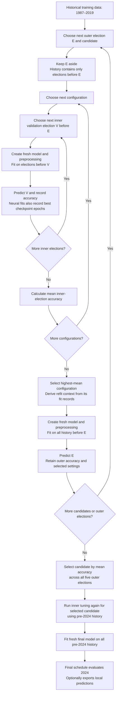
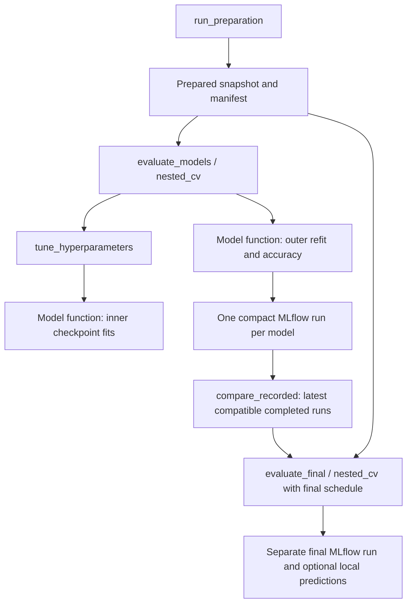

# The nested election prediction pipeline

This guide combines the model development specification and the module explainer. It describes the implemented pipeline: how nested cross-validation selects a modelling procedure, how model functions and compact MLflow records work, and what each file does.

## Reading guide

- [Nested cross-validation](#nested-cross-validation): the two loops and their flowchart.
- [Model specifications](#model-specifications): the settings searched and held fixed.
- [Modules and functions](#modules-and-functions): stage functions and MLflow recording.

## What the pipeline predicts

Each model estimates the probability that a Great Britain constituency will be won by Conservative, Labour, Liberal Democrat, SNP/Plaid Cymru or Other. The party with the highest probability becomes the predicted winner.

Constituency identifiers support joins and reporting. Election year controls chronological splitting and missing-data handling. Neither is supplied to the estimator as a predictor.

A **candidate** is a complete modelling procedure: its predictors, preprocessing, model architecture, search space, fixed settings, training policy and probability-combination rules. Historical evaluation compares these procedures. Each date can produce different selected settings and a different fitted model.

## Nested cross-validation

The pipeline uses **nested expanding-window cross-validation**, also called nested walk-forward validation. Whole elections form the folds, and training always uses earlier elections.

The **inner loop** chooses settings. For each configuration and inner validation election V, fit using elections before V, predict V, and measure accuracy. Average the accuracies with equal weight for each inner election. Select the configuration with the highest mean.

The **outer loop** measures the tuned procedure. For an outer election E, run the inner search using only history before E. Fit a fresh model on all that history using the selected settings, then predict E. E's outcomes are used only for scoring this forecast.

### Cross-validation flowchart



The loops create fresh model instances when fitting is required. Identical inner scores and fit records can be reused from an in-memory cache; conditional stages can also be reused within the same fold. Reuse does not move later data into an earlier forecast.

### Election schedule

| Outer election E | Inner validation elections V | History used for outer refit |
|---|---|---|
| 2005 | 1997, 2001 | 1987–2001 |
| 2010 | 1997, 2001, 2005 | 1987–2005 |
| 2015 | 1997, 2001, 2005, 2010 | 1987–2010 |
| 2017 | 1997, 2001, 2005, 2010, 2015 | 1987–2015 |
| 2019 | 1997, 2001, 2005, 2010, 2015, 2017 | 1987–2017 |
| Final 2024 fit, after candidate selection | 1997, 2001, 2005, 2010, 2015, 2017, 2019 | 1987–2019 |

Ranges refer to the available general elections within those dates. For each V, the inner training set contains only elections before V. Every scheduled inner fold requires at least two earlier training elections.

For example, the 2005 forecast tunes each configuration using two fits: train on 1987 and 1992 to predict 1997, then train on 1987, 1992 and 1997 to predict 2001. After choosing settings, it fits afresh through 2001 and predicts 2005.

A previous outer election legitimately becomes history for a later forecast. Its saved forecast remains the prediction made using the earlier information boundary.

### Selection and interpretation

```text
configuration score = mean accuracy across inner validation elections

candidate score = (accuracy_2005 + accuracy_2010 + accuracy_2015
                   + accuracy_2017 + accuracy_2019) / 5
```

Each election has equal weight regardless of its constituency count. Changed-seat accuracy, latest-three mean and other diagnostics do not alter selection. Exact model ties follow requested model order; exact configuration ties follow generated configuration order. There is no practical-tie threshold.

All candidates predict the same rows with known winners. Missing predictors are imputed rather than used to exclude difficult evaluation rows. Missing scheduled folds or fitting failures abort the comparison.

Learned preprocessing follows the same boundary as model fitting: training medians, category encodings, scaling and role mapping are fitted only on the relevant training history. Outer refits learn these afresh. Held-out outcomes do not determine settings or refit duration.

Early outer elections have less tuning evidence. The five-election mean measures a procedure as available history grows, rather than one fixed fitted model. Constituencies share national election conditions, and folds share historical data, so thousands of rows do not represent thousands of independent election environments.

The outer results also select the candidate. They are evidence for that selection, rather than a separate untouched assessment of the selected winner. The 2024 evaluation is retrospective: its results are already known and have informed project development.

## Model specifications

The current searches are defined alongside their model functions in `src/election/models/adapters/`. Every configuration is evaluated across all scheduled inner elections available at that forecast date.

| Candidate | Settings searched | Configurations |
|---|---|---|
| Logistic regression | `C`: 0.01, 0.1, 1, 10 | 4 |
| Random forest | `max_depth`: 5, 10, unrestricted; `min_samples_leaf`: 1, 5, 10; `max_features`: square root, 0.5 | 18 |
| XGBoost | `n_estimators`: 20, 35, 50, 100; `max_depth`: 2, 3, 4, 5 | 16 |
| XGBoost Expanded | Same tree-count/depth search, tuned independently | 16 |
| Conditional XGBoost | Each stage independently searches 25, 50, 100, 200 trees and depths 2, 3, 4, 5; pairs scored jointly | 256 |
| NN01 | Hidden layers fixed at 32/16; learning rates: 0.1, 0.2, 0.3, 0.5 | 4 |
| NN02 | Hidden layers fixed at 64/32; learning rates: 0.01, 0.03, 0.05, 0.1, 0.2, 0.3, 0.5, 1.0 | 8 |
| NN03 | Hidden layer fixed at 16; learning rate fixed at 0.3 | 1 |

A configuration count is not a total fit count: configurations are tested across several inner elections and outer dates. NN03 still runs the inner folds to derive training durations.

### Fixed settings

**Logistic regression:** L2 regularisation, `lbfgs`, 1,000 maximum iterations, tolerance 0.0001 and no class weighting. Numeric inputs are standardised. Convergence warnings cause fitting to fail.

**Random forest:** 300 trees, minimum split size 2, bootstrap sampling enabled, Gini criterion, no class weighting, random seed 42 and one worker.

**Boosted trees, including conditional stages:** learning rate 0.05, minimum child weight 1, split-gain threshold 0, full row/predictor sampling, L1 regularisation 0, L2 regularisation 1, histogram tree method, seed 42 and one worker. Tree count is selected directly, with no validation-based early stopping. Ordinary XGBoost predicts class probabilities; conditional stages use binary or multiclass objectives according to their observed labels.

**Neural candidates:** ten networks with seeds 101223–101232, ReLU hidden activations, cross-entropy loss, stochastic gradient descent, batch size 64, zero momentum, zero weight decay and no dropout. Their probabilities are averaged before scoring.

### Neural checkpoints and refit durations

During an inner fit, each seed trains for up to 1,000 epochs. After each epoch, it measures log loss on V. Any strictly lower loss counts as improvement; after 20 epochs without improvement, training stops and restores the lowest-loss checkpoint.

Log loss chooses checkpoints. Mean inner-election accuracy chooses the learning rate. The inner validation election participates in both decisions, so its accuracy is tuning evidence.

For each seed, take the median best-checkpoint epoch across inner folds for the selected configuration, round halves up and enforce at least one epoch. Fit fresh networks and preprocessing on all history before E for those durations. No validation election is reserved during this refit, and no outer outcomes are monitored.

### Conditional stage selection

The change stage trains on all training seats; the challenger stage trains on changed seats only. Their joint winner probabilities are scored on all validation rows. The 256 combinations therefore optimise the complete candidate, rather than independently selecting stages by different objectives.

Identical stage fits are cached within a fold. A fold with no changed training seats fails explicitly. A validation election without changed seats still contributes overall accuracy; its changed-seat diagnostic is unavailable.

## Modules and functions

The current restructuring keeps model mathematics and early stopping unchanged.
Each model module exposes a function, its hyperparameter candidate dictionary and
`TRAINING_METADATA`. Fitted pipelines, networks and conditional stages are internal
implementation objects. Configuration, transient fit records and returned results
are ordinary dictionaries.

| Module | Responsibility |
|---|---|
| `pipeline/preparation.py` | Existing ingestion, cleaning and SQL stages; immutable dataset snapshots |
| `pipeline/run_pipeline.py` | Independent evaluation/comparison/final stage functions, CLI and full orchestration |
| `models/config.py` | Named historical and final schedules, party/target/scoring definitions |
| `models/evaluation.py` | Schedule validation, election splitting, parameter combinations, tuning and nested CV |
| `models/tracking.py` | One compact MLflow run per evaluation, summary validation and compatible result retrieval |
| `models/compare_models.py` | Rank the latest compatible completed historical evaluation per model |
| `models/adapters/` | Existing model implementations, model functions, grids and fixed metadata |
| `models/model_function.py` | Common probability validation, accuracy and optional local final reports |
| `models/missing_data.py` | Training-fitted imputation |
| `models/custom_model.py`, `pipeline_model.py` | Small internal fitted-model helpers; dictionary fit contexts/records |



Only stage orchestration imports concrete model functions. The reusable evaluator
receives its function explicitly; model functions do not log to MLflow. Importing
modules never starts preparation, fitting or logging.

No model registry, training-policy hierarchy, evaluation-report or selection-result
class remains. The pipeline has a small local name-to-function mapping for its CLI.
The median-epoch rule now resides in the neural module and has the same behavior.

Comparison checks data identity, full schedule, target, scoring and evaluation
protocol. Recency uses completion time; a model's highest historical score is not
substituted for its latest compatible evaluation. The full pipeline requires all
requested models to have compatible completed records before final testing.

MLflow receives six accuracy metrics and one summary artifact per five-election
model comparison, plus a separate final run. It receives no per-constituency data,
fitted models, candidate-fit logs or epoch histories. Dataset manifests and CSVs
remain in preserved snapshot folders; MLflow contains their references.

See the repository [README](../README.md), [model interface guide](../src/election/models/README.md)
for commands, Python calls and recording fields.
