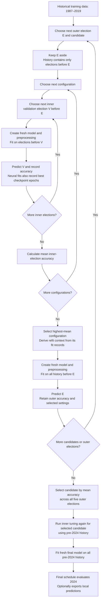
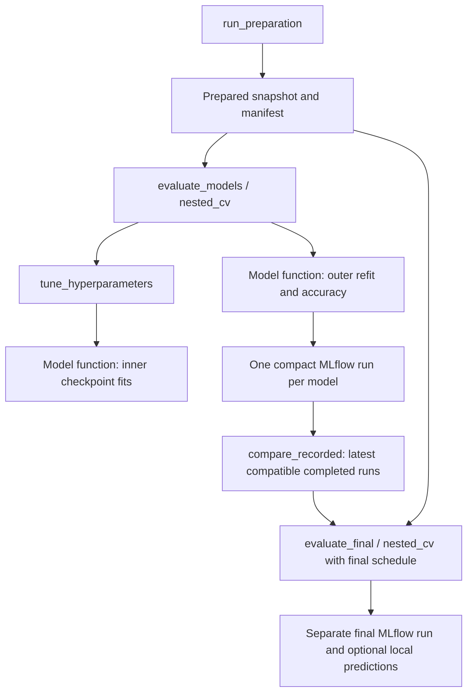

# The nested election prediction pipeline

This guide describes the entire implemented process: setup, source ingestion, PostgreSQL preparation, model preprocessing, nested historical evaluation, model selection, retrospective 2024 evaluation and MLflow recording. See the [directory guide](directories.md) for project structure and [intended next improvements](intended_next_improvements.md) for proposed changes.

## Reading guide

- [Quick start](#quick-start), [package and development](#package-and-development), and [independent stages](#run-stages-independently).
- [Preparation and stored data](#preparation-and-stored-data): sources, PostgreSQL snapshots and integrity checks.
- [Saved 2024 accuracy history](#saved-2024-accuracy-history): print completed MLflow results.
- [Nested cross-validation](#nested-cross-validation): the two loops and their flowchart.
- [Model specifications](#model-specifications): the settings searched and held fixed.
- [Modules and functions](#modules-and-functions): stage functions and MLflow recording.

## Quick start

Install [uv](https://docs.astral.sh/uv/getting-started/installation/), then run from the repository root:

```bash
uv sync --extra notebooks
setup/mlflow-services.sh install  # Install PostgreSQL 16 system software on Linux
setup/mlflow-services.sh init     # Initialise PostgreSQL and start background MLflow
setup/election-database.sh        # Create the separate election database
source setup/environment.sh
uv run --extra notebooks jupyter lab
```

The repository pins Python 3.14.2 in `.python-version`; uv can download it when
needed. `uv.lock` records resolved dependencies. The service scripts target the
Linux Codespace. On another machine, configure an existing PostgreSQL server and
MLflow server using `ELECTION_DATABASE_URL` and `MLFLOW_TRACKING_URI`.

For foreground MLflow, stop the managed background server once with
`setup/mlflow-services.sh stop-mlflow`, start PostgreSQL with
`setup/mlflow-services.sh postgres`, source `setup/environment.sh`, then run
`uv run mlflow server`. Ctrl+C stops the foreground server; PostgreSQL keeps
running. The stop-mlflow command manages only the script's background process.
The environment script preserves database credentials, artifact paths and
Codespaces access settings without modifying the private configuration files.

Open [00_run_pipeline.ipynb](../notebooks/00_run_pipeline.ipynb) and run all cells. Start Jupyter from the repository root or a directory within it. The notebook downloads the configured sources, checks the supplied local workbook, prepares features, compares all candidates and fits the selected procedure for 2024. It then predicts every test row, scores rows with known winners and displays a confusion matrix.

A full run includes nested searches and ten-network ensembles and can take substantial time. Internet access is required for ingestion. Dependency versions are locked in `uv.lock`; remote inputs can still change.

## Package and development

The project follows the [Python Packaging User Guide](https://packaging.python.org/en/latest/tutorials/packaging-projects/#creating-the-package-files) with a `src/` layout and regular packages marked by `__init__.py`. `pyproject.toml` defines the build backend, project metadata and dependencies. `uv sync` installs the project in editable mode, so the pipeline runs directly from `src/`. The `notebooks` extra adds notebook/report tools; the `dev` dependency group adds pytest and is installed by default. Commit `uv.lock` and `.python-version`, but keep `.venv` ignored. Use `uv add PACKAGE` or `uv add --dev PACKAGE` to manage dependencies, and `uv lock --upgrade` for an intentional dependency upgrade.

Import project modules explicitly so calls show their origin:

```python
from election.pipeline import run_pipeline

result = run_pipeline.run_pipeline(output_dir="outputs")
print(result["comparison"]["winner_model_id"])
print(result["final_evaluation"]["run_id"])
```

Run tests with `uv run pytest` after sourcing the database and MLflow configuration;
`tests/test_mlflow_pipeline.py` checks two synthetic pipeline executions against the configured MLflow server; PostgreSQL integration tests skip when their connection settings are absent. Normal development and pipeline execution do not require building a distribution. If packaging is needed, `setup.cfg` directs setuptools staging files to `/tmp/election-prediction-build` instead of creating a `build/` directory in this checkout. SQL queries and the checksum-verified local workbook are included in the installed package. When installed outside a checkout, default outputs go under the working directory's `outputs/`; use `output_dir` to choose another location.

Python modules and project-owned files use lowercase snake case; package directories use lowercase names. Standard filenames such as `README.md` and `__init__.py` retain their conventional spelling. Pipeline notebooks remain separate from the installable package.

## Run stages independently

Run these commands from the repository root; virtual environment activation is not required.
Start the services and load their connection settings once per terminal session:

```bash
setup/mlflow-services.sh start
source setup/environment.sh
```

Each stage reuses existing inputs where appropriate. Evaluation and final fitting
require the prepared PostgreSQL tables; saved reports require only their manifest
and/or MLflow. Reading reports does not start training.

### Prepare the data

Download and clean the source data, create the PostgreSQL training/test tables,
and save a manifest at `outputs/latest_prepared.json`. This does not fit models.

```bash
uv run python -m election.pipeline.run_pipeline prepare
```

### Evaluate one model on historical elections

Tune logistic regression using earlier elections and score it on each of the five
historical outer elections. Save the completed evaluation in MLflow, without
preparing data again or evaluating 2024.

```bash
uv run python -m election.pipeline.run_pipeline evaluate --model logistic_regression
```

### Evaluate every candidate

Run the same historical evaluation for all eight model procedures. This can take
substantial time, particularly for conditional XGBoost and neural ensembles.

```bash
uv run python -m election.pipeline.run_pipeline evaluate --model all
```

To evaluate just two candidates, name both models:

```bash
uv run python -m election.pipeline.run_pipeline evaluate --model logistic_regression random_forest
```

### Compare saved historical results

Print a readable ranking of the latest compatible completed evaluation for each
candidate, its mean historical accuracy and run ID. Also show the highest-ranked
model and its selection run ID. Missing or incompatible runs are reported;
comparison does not fit models or load PostgreSQL rows.

```bash
uv run python -m election.reports.comparison
```

To compare only the two candidates evaluated above:

```bash
uv run python -m election.reports.comparison --model logistic_regression random_forest
```

For the full comparison dictionary as JSON, including compatibility fields, use:

```bash
uv run python -m election.pipeline.run_pipeline compare
```

### Evaluate the selected model on 2024

Replace `HISTORICAL_RUN_ID` with the selection run ID from the historical
comparison. Tune that model again using pre-2024 history, fit it through 2019,
and score 2024. Record a separate final MLflow run and write predictions and
confusion-matrix reports under `outputs/reports/`.

```bash
uv run python -m election.pipeline.run_pipeline final --selection-run HISTORICAL_RUN_ID
```

### Print saved 2024 accuracy and model specifications

List completed final evaluations, newest first, with percentage accuracy, run ID,
model architecture, fixed settings, tuning search space and selected 2024
hyperparameters. Early stopping settings are included when recorded.

```bash
uv run python -m election.reports.accuracy_history
```

The earlier `uv run python -m election.models.accuracy_history` command remains supported.

### Inspect one saved evaluation

Replace `RUN_ID` with any completed historical or final evaluation ID. Print its
model specifications, data references, election accuracies, selected settings,
inner scores and recorded refit durations. This retrieves saved MLflow results.

```bash
uv run python -m election.reports.run_details RUN_ID
```

### Inspect the prepared-data manifest

Print the latest dataset identities, retained PostgreSQL schema and predictor-guide
location. This reads the manifest without querying table rows.

```bash
uv run python -m election.reports.prepared_data
```

### Run the complete pipeline

Prepare data, evaluate all candidates, compare historical results and evaluate the
historically selected model on 2024.

```bash
uv run python -m election.pipeline.run_pipeline all
```

To stop after historical evaluation and comparison, omit the final evaluation:

```bash
uv run python -m election.pipeline.run_pipeline all --skip-final
```

### Reuse preparation and saved historical evaluations

Use the existing prepared manifest and compatible completed MLflow evaluations,
then tune and evaluate the selected model on 2024. This avoids running preparation
and historical training again. All requested models must have compatible records.

```bash
uv run python -m election.pipeline.run_pipeline all --data-dir outputs/latest_prepared.json --reuse-evaluations
```

To reuse results for a subset, add `--model logistic_regression random_forest`.
Add `--skip-final` to perform only the saved comparison.

### Choose input and output locations

Use `--data-dir` to select an existing manifest, its snapshot folder, or an outputs
folder containing `latest_prepared.json`. For example, inspect a particular snapshot:

```bash
uv run python -m election.reports.prepared_data --data-dir outputs/datasets/SNAPSHOT_ID
```

The evaluation, comparison, final and full-pipeline commands also accept
`--data-dir`. Independent stages default to `outputs/latest_prepared.json`.

Use `--output-dir` to choose where preparation metadata and final reports are
written. For example, run the complete pipeline into another folder:

```bash
uv run python -m election.pipeline.run_pipeline all --output-dir outputs/another_run
```

Its manifest is `outputs/another_run/latest_prepared.json`, and final reports go
under `outputs/another_run/reports/`. To read that run's comparison, pass
`--data-dir outputs/another_run` to `election.reports.comparison`.

Use `--quiet` to hide fitting progress while keeping the final stage result:

```bash
uv run python -m election.pipeline.run_pipeline evaluate --model logistic_regression --quiet
```

The pipeline stage commands print their result dictionaries as JSON. The
`election.reports` commands provide readable saved summaries. Prepared rows live
in the manifest's PostgreSQL schema, in `train_data` and `test_data`; preparation
saves metadata rather than CSV copies. The Python API remains available for
programmatic use, including external CSV inputs.

## Preparation and stored data

Preparation reads the configured historical, notional, 2024 and polling sources. The bundled 1997 workbook is checksum-verified. Cleaning normalises the inputs before loading them into a new PostgreSQL run schema. Six SQL scripts join previous elections and polling, engineer predictors and create `train_data` and `test_data`. Training covers available elections through 2019; the final test contains 2024. SQL preparation commits atomically, retaining successful schemas for inspection and rolling back failed runs.

`run_preparation` writes content identities, the retained `database_schema` and predictor-guide location to `outputs/datasets/<snapshot>/prepared_data.json`, then updates `outputs/latest_prepared.json`. It does not write train/test CSV copies. Repeated identical datasets reuse the saved manifest and its original schema reference.

`load_prepared` reads the retained PostgreSQL tables in a read-only transaction with a consistent snapshot and deterministic row ordering. It normalises the model representation in memory to preserve the existing content identities and dtypes, then checks those identities before evaluation. Historical evaluation reads only training rows; final evaluation also reads 2024 rows. PostgreSQL must remain available. Explicit external CSV paths remain supported, but database-backed manifests use their schema even if legacy CSV paths are present.

Model-specific normalisation, encoding, scaling, imputation and conditional role handling currently run inside the model-fitting implementations. Learned transformations fit only on each fold’s training data and are reused for its held-out rows. They are currently repeated as part of model fits; performing it once before each nested-CV iteration’s algorithm fits and reusing it across compatible fits is proposed in the improvements document.

Final evaluation writes optional `test_predictions.csv`, `test_confusion_matrix.csv`
and `test_confusion_matrix.png` under `outputs/reports/` by default. These reports
are replaced on reruns; dataset manifests and MLflow evaluations retain their
separate histories. The pipeline notebook displays the chart from this reports folder.

## Saved 2024 accuracy history

With the MLflow service running:

```bash
source setup/environment.sh
uv run python -m election.reports.accuracy_history
```

Alternatively, run `uv run src/election/reports/accuracy_history.py` from the repository root. The command prints completion time (UTC), model, percentage accuracy and run ID, newest first, across completed compact final evaluations. `--experiment NAME` and `--tracking-uri URL` select another experiment or server. It also prints the saved model architecture, training protocol, fixed settings, tuning search space, selected 2024 hyperparameters and any early stopping settings. It reads saved results without training. Each full pipeline run evaluates only the historically selected candidate on 2024; it does not automatically produce 2024 scores for every candidate.

## What the pipeline predicts

Each model estimates the probability that a Great Britain constituency will be won by Conservative, Labour, Liberal Democrat, SNP/Plaid Cymru or Other. The party with the highest probability becomes the predicted winner.

Constituency identifiers support joins and reporting. Election year controls chronological splitting and missing-data handling. Neither is supplied to the estimator as a predictor.

A **candidate** is a complete modelling procedure: its predictors, preprocessing, model architecture, search space, fixed settings, training policy and probability-combination rules. Historical evaluation compares these procedures. Each date can produce different selected settings and a different fitted model.

## Nested cross-validation

The pipeline uses **nested expanding-window cross-validation**, also called nested walk-forward validation. Whole elections form the folds, and training always uses earlier elections.

The **inner loop** chooses settings. For each configuration and inner validation election V, fit using elections before V, predict V, and measure accuracy. Average the accuracies with equal weight for each inner election. Select the configuration with the highest mean.

The **outer loop** measures the tuned procedure. For an outer election E, run the inner search using only history before E. Fit a fresh model on all that history using the selected settings, then predict E. E's outcomes are used only for scoring this forecast.

### Cross-validation flowchart



The loops create fresh model instances when fitting is required. Identical inner scores and fit records can be reused from an in-memory cache; conditional stages can also be reused within the same fold. Reuse does not move later data into an earlier forecast.

### Election schedule

| Outer election E | Inner validation elections V | History used for outer refit |
|---|---|---|
| 2005 | 1997, 2001 | 1987–2001 |
| 2010 | 1997, 2001, 2005 | 1987–2005 |
| 2015 | 1997, 2001, 2005, 2010 | 1987–2010 |
| 2017 | 1997, 2001, 2005, 2010, 2015 | 1987–2015 |
| 2019 | 1997, 2001, 2005, 2010, 2015, 2017 | 1987–2017 |
| Final 2024 fit, after candidate selection | 1997, 2001, 2005, 2010, 2015, 2017, 2019 | 1987–2019 |

Ranges refer to the available general elections within those dates. For each V, the inner training set contains only elections before V. Every scheduled inner fold requires at least two earlier training elections.

For example, the 2005 forecast tunes each configuration using two fits: train on 1987 and 1992 to predict 1997, then train on 1987, 1992 and 1997 to predict 2001. After choosing settings, it fits afresh through 2001 and predicts 2005.

A previous outer election legitimately becomes history for a later forecast. Its saved forecast remains the prediction made using the earlier information boundary.

### Selection and interpretation

```text
configuration score = mean accuracy across inner validation elections

candidate score = (accuracy_2005 + accuracy_2010 + accuracy_2015
                   + accuracy_2017 + accuracy_2019) / 5
```

Each election has equal weight regardless of its constituency count. Changed-seat accuracy, latest-three mean and other diagnostics do not alter selection. Exact model ties follow requested model order; exact configuration ties follow generated configuration order. There is no practical-tie threshold.

All candidates predict the same rows with known winners. Missing predictors are imputed rather than used to exclude difficult evaluation rows. Missing scheduled folds or fitting failures abort the comparison.

Learned preprocessing follows the same boundary as model fitting: training medians, category encodings, scaling and role mapping are fitted only on the relevant training history. Outer refits learn these afresh. Held-out outcomes do not determine settings or refit duration.

Early outer elections have less tuning evidence. The five-election mean measures a procedure as available history grows, rather than one fixed fitted model. Constituencies share national election conditions, and folds share historical data, so thousands of rows do not represent thousands of independent election environments.

The outer results also select the candidate. They are evidence for that selection, rather than a separate untouched assessment of the selected winner. The 2024 evaluation is retrospective: its results are already known and have informed project development.

## Model specifications

The current searches are defined alongside their model functions in `src/election/models/adapters/`. Every configuration is evaluated across all scheduled inner elections available at that forecast date.

| Candidate | Settings searched | Configurations |
|---|---|---|
| Logistic regression | `C`: 0.01, 0.1, 1, 10 | 4 |
| Random forest | `max_depth`: 5, 10, unrestricted; `min_samples_leaf`: 1, 5, 10; `max_features`: square root, 0.5 | 18 |
| XGBoost | `n_estimators`: 20, 35, 50, 100; `max_depth`: 2, 3, 4, 5 | 16 |
| XGBoost Expanded | Same tree-count/depth search, tuned independently | 16 |
| Conditional XGBoost | Each stage independently searches 25, 50, 100, 200 trees and depths 2, 3, 4, 5; pairs scored jointly | 256 |
| NN01 | Hidden layers fixed at 32/16; learning rates: 0.1, 0.2, 0.3, 0.5 | 4 |
| NN02 | Hidden layers fixed at 64/32; learning rates: 0.01, 0.03, 0.05, 0.1, 0.2, 0.3, 0.5, 1.0 | 8 |
| NN03 | Hidden layer fixed at 16; learning rate fixed at 0.3 | 1 |

A configuration count is not a total fit count: configurations are tested across several inner elections and outer dates. NN03 still runs the inner folds to derive training durations.

### Fixed settings

**Logistic regression:** L2 regularisation, `lbfgs`, 1,000 maximum iterations, tolerance 0.0001 and no class weighting. Numeric inputs are standardised. Convergence warnings cause fitting to fail.

**Random forest:** 300 trees, minimum split size 2, bootstrap sampling enabled, Gini criterion, no class weighting, random seed 42 and one worker.

**Boosted trees, including conditional stages:** learning rate 0.05, minimum child weight 1, split-gain threshold 0, full row/predictor sampling, L1 regularisation 0, L2 regularisation 1, histogram tree method, seed 42 and one worker. Tree count is selected directly, with no validation-based early stopping. Ordinary XGBoost predicts class probabilities; conditional stages use binary or multiclass objectives according to their observed labels.

**Neural candidates:** ten networks with seeds 101223–101232, ReLU hidden activations, cross-entropy loss, stochastic gradient descent, batch size 64, zero momentum, zero weight decay and no dropout. Their probabilities are averaged before scoring.

### Neural checkpoints and refit durations

During an inner fit, each seed trains for up to 1,000 epochs. After each epoch, it measures log loss on V. Any strictly lower loss counts as improvement; after 20 epochs without improvement, training stops and restores the lowest-loss checkpoint.

Log loss chooses checkpoints. Mean inner-election accuracy chooses the learning rate. The inner validation election participates in both decisions, so its accuracy is tuning evidence.

For each seed, take the median best-checkpoint epoch across inner folds for the selected configuration, round halves up and enforce at least one epoch. Fit fresh networks and preprocessing on all history before E for those durations. No validation election is reserved during this refit, and no outer outcomes are monitored.

### Conditional stage selection

The change stage trains on all training seats; the challenger stage trains on changed seats only. Their joint winner probabilities are scored on all validation rows. The 256 combinations therefore optimise the complete candidate, rather than independently selecting stages by different objectives.

Identical stage fits are cached within a fold. A fold with no changed training seats fails explicitly. A validation election without changed seats still contributes overall accuracy; its changed-seat diagnostic is unavailable.

## Modules and functions

The current restructuring keeps model mathematics and early stopping unchanged.
Each model module exposes a function, its hyperparameter candidate dictionary and
`TRAINING_METADATA`. Fitted pipelines, networks and conditional stages are internal
implementation objects. Configuration, transient fit records and returned results
are ordinary dictionaries.

| Module | Responsibility |
|---|---|
| `pipeline/preparation.py` | Ingestion, cleaning, PostgreSQL preparation, manifests and verified database reads |
| `pipeline/run_pipeline.py` | Independent evaluation/comparison/final stage functions, CLI and full orchestration |
| `models/config.py` | Named historical and final schedules, party/target/scoring definitions |
| `models/evaluation.py` | Schedule validation, election splitting, parameter combinations, tuning and nested CV |
| `reports/` | Terminal commands for saved accuracy/specifications, historical comparisons, individual evaluation details and prepared-data manifests |
| `models/boosting.py` | Shared XGBoost defaults, party-label encoding and preprocessing/training pipeline |
| `models/tracking.py` | One compact MLflow run per evaluation, summary validation and compatible result retrieval |
| `models/compare_models.py` | Rank the latest compatible completed historical evaluation per model |
| `models/adapters/` | Existing model implementations, model functions, grids and fixed metadata |
| `models/model_function.py` | Common probability validation, accuracy and optional local final reports |
| `models/missing_data.py` | Training-fitted imputation |
| `models/custom_model.py`, `pipeline_model.py` | Small internal fitted-model helpers; dictionary fit contexts/records |



Only stage orchestration imports concrete model functions. The reusable evaluator
receives its function explicitly; model functions do not log to MLflow. Importing
modules never starts preparation, fitting or logging.

No model registry, training-policy hierarchy, evaluation-report or selection-result
class remains. The pipeline has a small local name-to-function mapping for its CLI.
The median-epoch rule now resides in the neural module and has the same behavior.

Comparison checks data identity, full schedule, target, scoring and evaluation
protocol. Recency uses completion time; a model's highest historical score is not
substituted for its latest compatible evaluation. The full pipeline requires all
requested models to have compatible completed records before final testing.

MLflow receives six accuracy metrics and one summary artifact per five-election
model comparison, plus a separate final run. It receives no per-constituency data,
fitted models, candidate-fit logs or epoch histories. Prepared datasets remain in retained PostgreSQL schemas; snapshot folders hold
manifests and predictor guides. MLflow contains their references.

See the repository [README](../README.md), [model interface guide](../src/election/models/README.md)
for the project overview and recording fields. Setup, stage commands and Python
calls are documented above.
